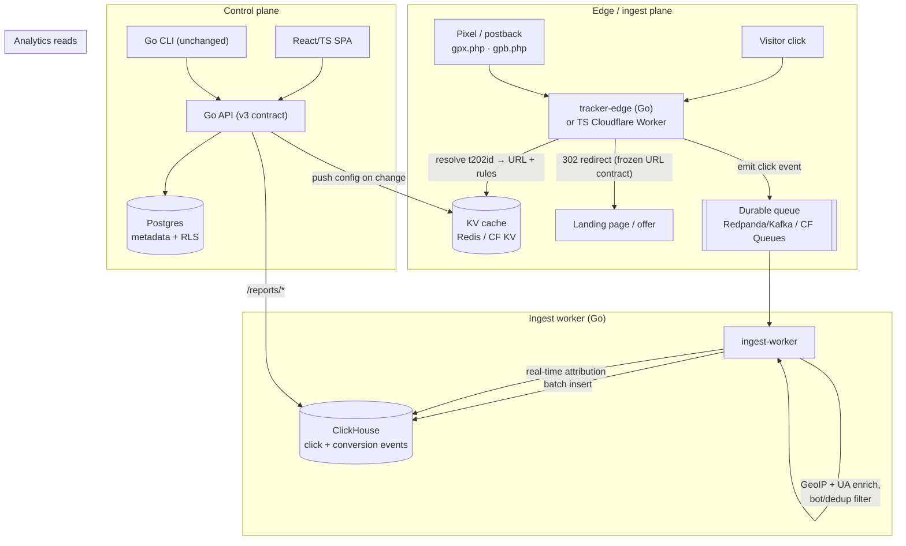

# 01 — Target Architecture (North Star)

## The central insight: three workloads, not one

Today everything runs through one PHP + MySQL monolith. But an ad tracker is three
workloads with **opposite** characteristics:

| Plane | Job | Profile | Today | Greenfield store/runtime |
|-------|-----|---------|-------|--------------------------|
| **Edge / ingest** | Capture click, redirect, record pixel/postback | Write-heavy, latency-critical (<50 ms global), high QPS | `record_*.php`, `dl.php` → synchronous MySQL inserts | Go service + queue (no DB on hot path) |
| **Control** | CRUD campaigns, trackers, networks, rotators, users | Low volume, transactional, relational | MySQL via v3 API + legacy PHP pages | Go API + Postgres |
| **Analytics** | Reports, breakdowns, timeseries, daypart, attribution | Read-heavy OLAP over billions of append-only events | Row tables + `class-dataengine.php` | ClickHouse |

Separating them is the whole game. Everything below follows from it.

## System view

## Component-by-component

### Edge / ingest plane — `tracker-edge` (Go) + optional TS Worker

Replaces `tracking202/static/record_simple.php`, `record_adv.php`, and
`tracking202/redirect/dl.php`.

- **Stateless and portable.** A Go binary in a container that any load balancer can
  front. The same redirect spec compiles to a **TypeScript Cloudflare Worker** for true
  global edge latency — the Worker is the optional accelerator, the Go container is the
  default.
- **KV-first, always.** Resolves `t202id` → redirect URL + rotator rules from a KV cache
  (Redis self-hosted / Cloudflare KV optional). The control plane pushes config to KV on
  change. This **inverts** today's model (MySQL-first with a memcache *fallback*) so the
  primary DB is never on the hot path.
- **Fire-and-forget events.** The click is emitted to a **durable queue** and the
  redirect returns immediately — replacing today's synchronous inserts across
  `clicks`, `clicks_advance`, `clicks_record`, `clicks_site`, `clicks_tracking`,
  `clicks_variable`, etc. Reliable, replayable, and an order of magnitude lower latency.
- **Config-driven param extraction.** The 18+ duplicated keyword/search-engine branches
  in `record_*.php` collapse into a single config table (`OVKEY`, `OVRAW`, `keyword`,
  `query`, … become data, not code).

### Ingest worker (Go)

- Consumes the click stream; performs **GeoIP** (MaxMind), **UA parsing**, bot/dedup
  filtering, and **batch-writes** enriched events to ClickHouse.
- **Idempotent and replayable** — reprocessing the stream rebuilds analytics, which also
  powers the Phase-1 shadow/backfill validation.
- Computes **attribution in-stream** (the 6 existing models: first/last touch, linear,
  time-decay, position-based, algorithmic) instead of hourly cron snapshots.

### Analytics store — ClickHouse

- Columnar storage replaces the row-oriented `202_clicks*` tables. The existing report
  shapes (summary, breakdown, timeseries, daypart, weekpart) map directly to ClickHouse
  aggregations and run orders of magnitude faster at scale.
- **Self-hostable** (single binary / container); managed alternatives — ClickHouse Cloud,
  Tinybird, or Cloudflare Analytics Engine — are the optional cloud flavor.
- Retires the 2008-era `class-dataengine.php` (1,832 lines) and
  `ReportBasicForm.class.php` (3,020 lines).

### Control plane — Go API + Postgres

- **Keeps the existing v3 resource contract** (`api/V3/` routes) — it's recent and good,
  so it becomes the spec the Go service implements. The Go CLI (`go-cli/`) and any
  clients keep working unchanged.
- Metadata (users, campaigns, trackers, networks, rotators, attribution model defs) lives
  in **Postgres** with a real migration tool (Atlas or golang-migrate + sqlc), replacing
  the generated `202-config.php` and ad-hoc SQL-script migrations.
- **Multi-tenant from day one** via Postgres **Row-Level Security** (`tenant_id`
  isolation enforced by the database) — replacing today's fragile app-layer
  `WHERE user_id = ?` filtering. **JSONB** models the semi-structured rotator-rule,
  attribution-model, and network-integration configs.

### Frontend — React/TypeScript SPA

- React/Next.js (or Remix) + shadcn/ui, Vite/Turbo build, real-time dashboards via
  SSE/websockets — replacing the PHP-rendered `202-account/` pages and the
  jQuery/Bootstrap-3 frontend (`202-js/`) with no build pipeline.

### Cross-cutting

- **Auth:** OIDC for users + scoped API keys (keep the existing scope model);
  **Argon2id** passwords, dropping MD5 acceptance.
- **Observability:** OpenTelemetry traces/metrics/logs across all services.
- **Infra:** IaC (Terraform/Pulumi); containers everywhere; a `docker-compose`
  single-box profile for self-host; 12-factor config + a secrets manager (no generated
  `202-config.php`).

## The hybrid/portable contract

Every cloud service has a self-hostable OSS **primary**, selected behind a thin interface
so the *same build* runs on one Docker host or fans out to the edge:

| Concern | Portable default (OSS) | Optional managed / edge |
|---------|------------------------|-------------------------|
| Redirect compute | Go `tracker-edge` container | Cloudflare Worker (TS) |
| Hot config | Redis | Cloudflare KV |
| Event queue | Redpanda / Kafka | Cloudflare Queues |
| Analytics DB | ClickHouse | ClickHouse Cloud / Tinybird / CF Analytics Engine |
| Object storage | MinIO (S3-compatible) | Cloudflare R2 / S3 |
| Metadata DB | Postgres | Managed Postgres |

The interfaces (`ConfigStore`, `EventSink`, `AnalyticsWriter`, `BlobStore`) are the
seams that keep "world-class cloud-native" and "runs on my own box" the same codebase.
