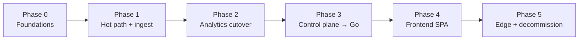
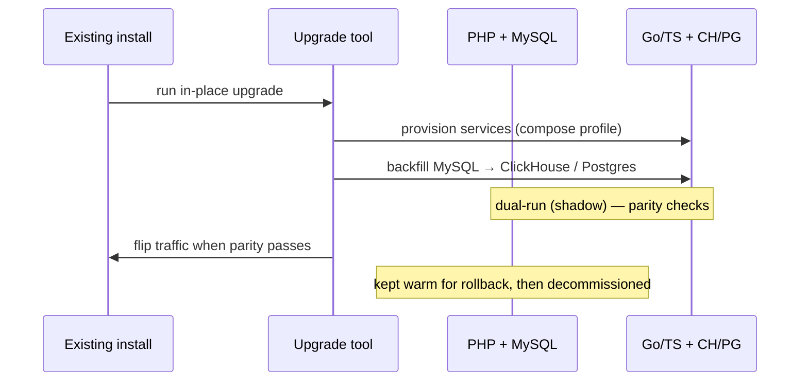

# 02 — Migration Roadmap (Strangler Fig)

We do **not** big-bang rewrite. We evolve the monolith behind two stable seams and peel
off one workload at a time. Each phase ships independently, runs in parallel with the old
path, and is reversible.

## The two seams

1. **The v3 API contract** (`api/V3/`) — internal seam. The Go CLI and clients already
   speak it, so we can replace implementations behind each route without breaking callers.
2. **The public URL contract** (`/tracking202/redirect/*`, `/tracking202/static/*`) —
   external seam. Frozen forever; existing links must keep resolving.

## Phase overview

### Phase 0 — Foundations *(no behavior change)*
- Commit this doc set + ADRs.
- Stand up ClickHouse, the queue, KV, and **Postgres** instances (compose profiles).
- Add OpenTelemetry to the existing PHP; clean containerization; CI gates.
- **Ships:** infra + instrumentation. **Rollback:** nothing user-facing to revert.

### Phase 1 — Fix & decouple the hot path *(highest ROI)*
Targets the worst tech debt: `tracking202/static/record_simple.php`, `record_adv.php`,
`tracking202/redirect/dl.php`.
- Rewrite the hot path to **KV-first config lookup** + **emit click events to the queue**
  instead of synchronous MySQL inserts; collapse the duplicated keyword-extraction
  branches into a config table.
- Do it **in PHP first** (low risk, same files), then drop in the Go `tracker-edge`
  behind the identical URLs.
- Stand up the Go `ingest-worker` consuming the queue and **dual-writing** to the legacy
  MySQL click tables *and* ClickHouse (shadow). Validate parity.
- **Ships:** decoupled, reliable, low-latency capture. **Rollback:** flip back to direct
  inserts; the queue/ClickHouse run in shadow only until parity is proven.

### Phase 2 — Analytics cutover
- Point the `/reports/*` v3 endpoints at ClickHouse; run them **in parallel** with the
  MySQL `class-dataengine` reports, diff results, then cut over.
- Replace hourly attribution snapshots with the real-time in-stream computation.
- Retire `class-dataengine.php` and `ReportBasicForm.class.php`.
- **Ships:** fast reporting + real-time attribution. **Rollback:** repoint endpoints to
  the MySQL path (kept warm until cutover is confirmed).

### Phase 3 — Control plane to Go
- Reimplement v3 controllers in the Go API service **route-by-route** behind a gateway;
  PHP serves any route not yet ported.
- Migrate metadata to **Postgres**; introduce multi-tenancy via **Row-Level Security**.
- **Ships:** typed, testable control plane + tenant isolation. **Rollback:** gateway
  routes the affected paths back to PHP.

### Phase 4 — Frontend SPA
- Build the React/TypeScript UI against v3 **page-by-page** behind a path prefix.
- Retire `202-account/` PHP pages and `202-js/` jQuery per section as parity is reached.
- **Ships:** modern UI incrementally. **Rollback:** path prefix falls back to the PHP page.

### Phase 5 — Edge acceleration + decommission
- Deploy the TS Worker redirect variant for global latency (the cloud flavor — optional).
- Decommission Apache/PHP, memcache, and file-cron.
- The self-host profile remains via the Go container + `docker-compose`.
- **Ships:** edge latency + a lean runtime. **Rollback:** Workers are additive; the Go
  container stays authoritative.

## Phase ↔ legacy-hotspot map

| Current hotspot | Retired/replaced in |
|-----------------|---------------------|
| `tracking202/static/record_simple.php`, `record_adv.php` | Phase 1 |
| `tracking202/redirect/dl.php` | Phase 1 (logic), Phase 5 (edge) |
| `202-config/functions-tracking202.php` (3,864 lines) | Phases 1–3 (decomposed into services) |
| `202-config/class-dataengine.php`, `ReportBasicForm.class.php` | Phase 2 |
| `202_clicks*` MySQL tables | Phase 1 (shadow) → Phase 2 (cutover) |
| v3 controllers in `api/V3/` | Phase 3 (reimplemented in Go, contract preserved) |
| `202-account/` PHP pages, `202-js/` jQuery | Phase 4 |
| Apache/PHP runtime, memcache, file-cron | Phase 5 |

---

## Transition for existing self-hosted installs *(non-negotiable)*

Installs are self-hosted with **live tracking links in the wild**, so this is a
transparent **in-place upgrade**, not a "move to a new product" event. Five rules:

1. **The URL contract is frozen.** `tracker-edge` (and the optional Worker) serve the
   exact legacy paths and query-param semantics — `/tracking202/redirect/go.php` &
   `rtr.php`, `/tracking202/static/record.php`, `gpx.php`, `gpb.php`, `upx.php`, including
   `t202id`, `t202kw`, `t202b`, `c1`–`c4`, `gclid`/`fbclid`/`msclkid`, and `utm_*`.
   Existing links, pixels, and network postbacks keep working with **zero user action**.
   *Verified by replaying captured production URLs against old and new and diffing the
   redirect target + recorded event.*
2. **Identifiers are preserved exactly.** `tracker_id_public`, `click_id_public`, and API
   keys carry over unchanged so in-flight links resolve and the CLI/clients keep
   authenticating.
3. **Data is backfilled, not abandoned.** A one-time ETL backfills historical
   `202_clicks*` → ClickHouse and `202_*` metadata → Postgres. The Phase-1 **dual-write
   shadow** runs both stores in parallel; cutover happens only after row-count + aggregate
   parity checks pass. Reversible until then.
4. **In-place, automated upgrade.** Reuse the existing installer/auto-upgrade path: the
   upgrade adds the new Go/TS services + Postgres/ClickHouse/queue/KV to the user's
   `docker-compose` profile *alongside* PHP, dual-runs, then flips. Self-hosters stay
   self-hosted (the Go container replaces Apache/PHP on their own box); the managed/edge
   deployment is a separate **optional** offering, never forced.
5. **Auth carries forward.** Keep the existing MD5→Argon2id rehash-on-login; add OIDC as
   an option while local accounts continue to work; force-reset only stragglers who never
   log in.

