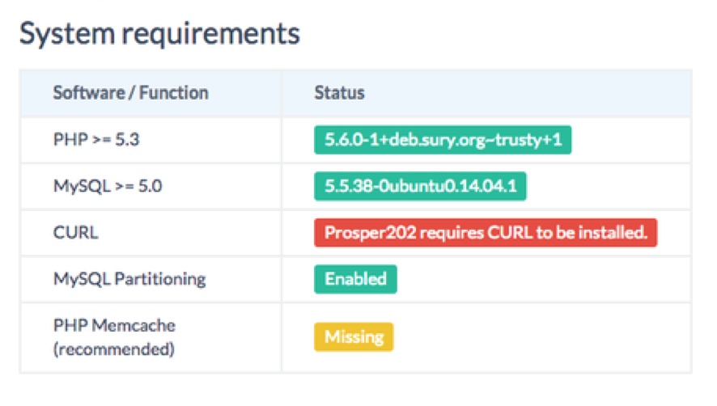

# Installing Prosper202

## Downloading Prosper202

You can download our latest version here: **https://my.tracking202.com**. 

Please note that our software is free to download. 

Documentation, tutorials, and what you find here are available for free but beyond that, if you require support of any kind, you'll need to be on a premium paid support plan. You can sign up and view our support plans here:  

**https://my.tracking202.com**

## Installing Prosper202

You will need a [web host](../partnering-with-us/01-web-hosting-services.md) in order to install Prosper202. We highly recommend getting at least VPS hosting as some shared hosting services do not work with well with Prosper202. If you need recommendations for a web host to install Prosper202, we recommend these hosting companies [here](../partnering-with-us/01-web-hosting-services.md)

Our installer was inspired by the WordPress installer, and we have made it almost exactly the same as theirs. It can generally be installed in about 5 minutes or less by simply uploading the files to a dedicated domain and then running the installer. The following installation guide will help you install Prosper202.

Before you begin the install, there are few things you need to check, have, and do.

## System Requirements

Below is a sample screenshot of what you'll need with your hosting company to install Prosper202

If you are not using one of our recommend hosts and are unsure if your host supports the above, please ask your hosting company. Every host should be able to host the requirements above, just maybe not by default.

## Things You Need For The Installation

You need access to your site and its directory and software to proceed with the installation.

These are:

1. An access to your web server (via shell or FTP).
2. A text editor.
3. An FTP Client (if you need to install Prosper202 on a remote server).
4. Your web browser of choice.

Begin your installation by:

1. Checking to ensure that you and your web host has the [minimum requirements](http://prosper.tracking202.com/apps/about/requirements.php) to run Prosper202.
2. Download the latest release of Prosper202.
3. Unzip the downloaded file to a folder on your hard drive.
4. Print this page out if necessary so you have it handy during the installation.

**Note:** *Please install Prosper on its own domain. Although some people have installed it on a subdomain or a subdirectory, this is not recommended and if you are having issues, please install it on its own domain. If you require assistance, please see our note above about subscribing to a support plan.*

You will need to rename 202-config-sample.php to 202-config.php and create a new database and new database user with your web host. Once you do, enter this information in the 202-config.php file in the correct spot and go to your URL to proceed with finishing installing Prosper202.

You should be able to create a new username and password for your Prosper install and login with that.

## How-To Install Video

**Video:** [Prosper202 Tutorial - How To Install Prosper202 1.8.3](https://www.youtube.com/watch?v=Qbb8k0F3SjA&feature=youtu.be)

**[Click here to proceed to Step 0](01-step-0.md)**