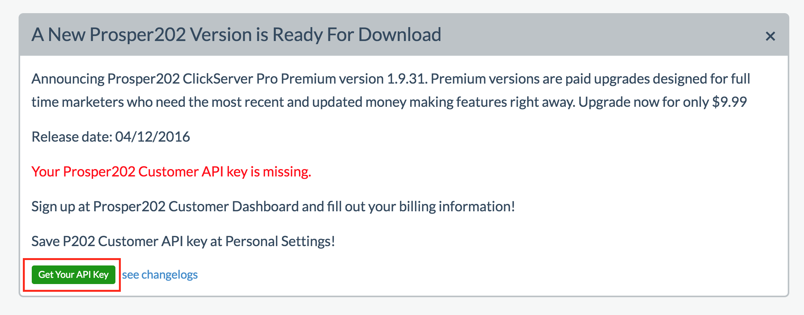
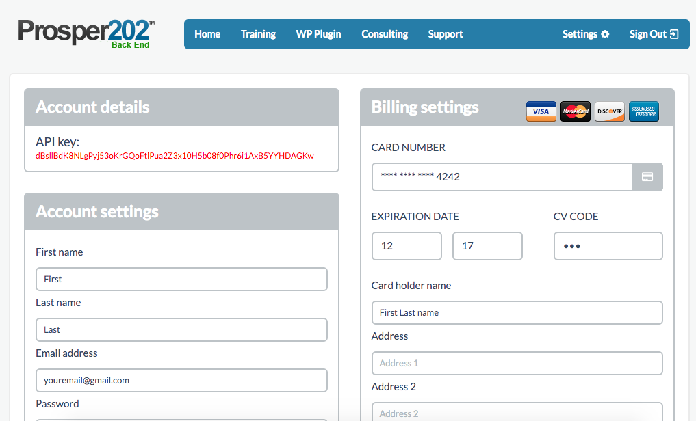
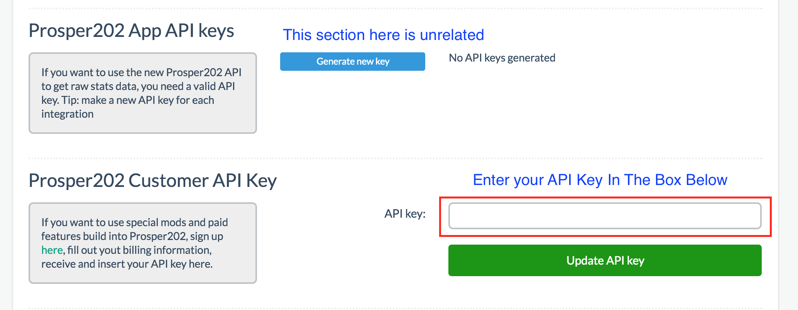
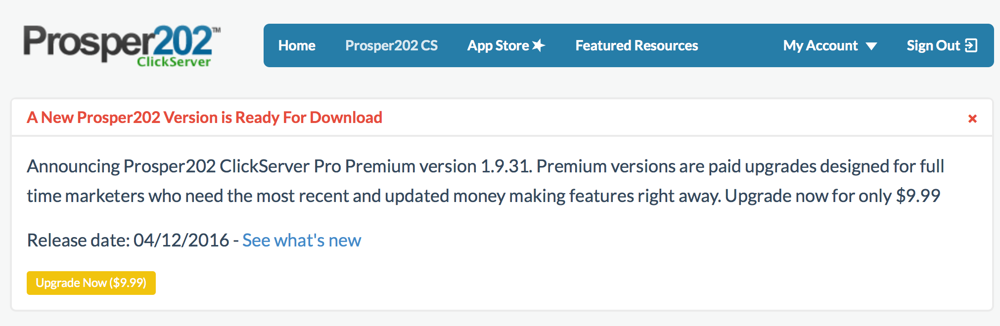
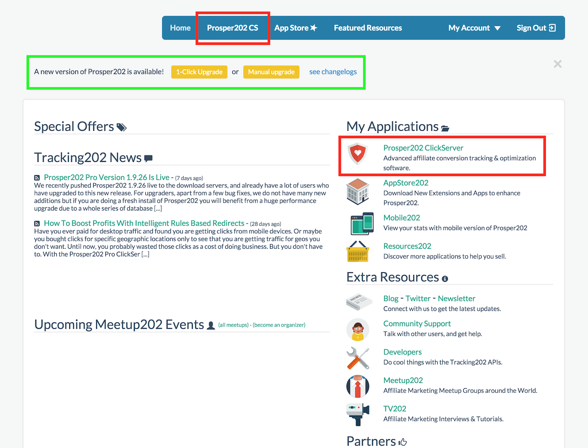
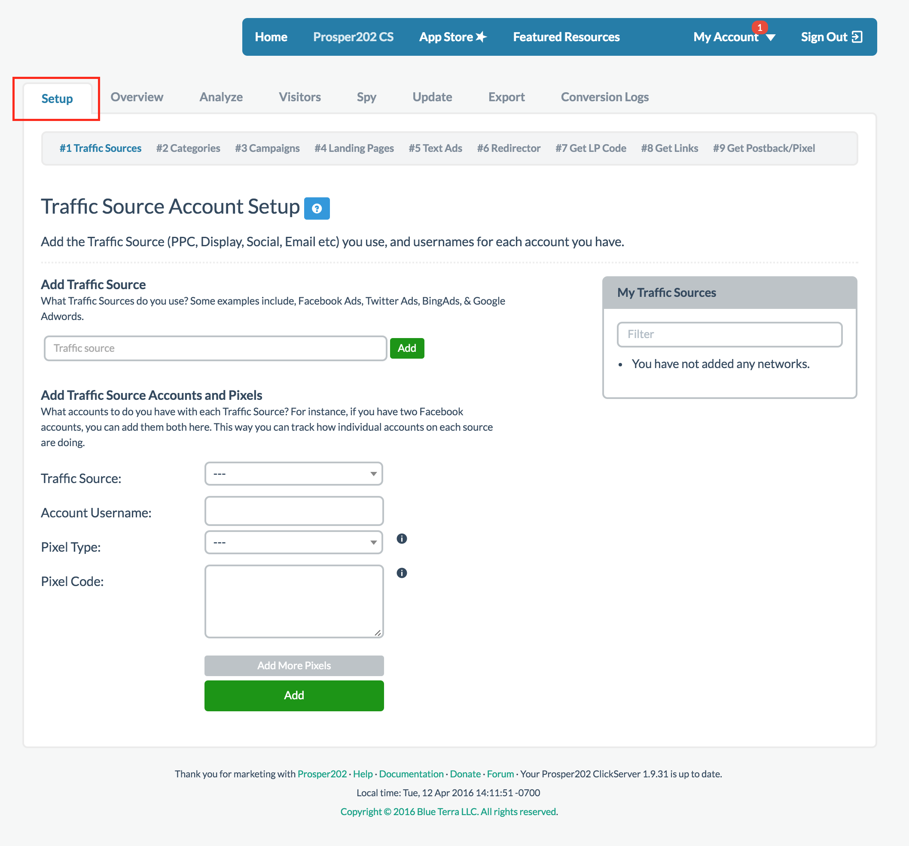

# Step 0 - Getting Started

## Pre-requisites

If you haven't done so already, download the latest version of [Prosper202](https://my.tracking202.com/) and follow our [installation instructions](00-installation.md). 

Once you've completed these steps, the following guide will help walk you through setting up a campaign.

## Support

*Please note that we do not offer free support. If you require any assistance or need support in any way beyond what is available on this site, you can subscribe to one of our [support plans](http://join.tracking202.com).* 

Because of this, we strongly recommend you browse around this site and review all of the information here.

## Prosper202 Customer API Key

Whether you're new to Prosper or have been users for a long time, one of the changes we recently made is including a new Prosper202 Customer API integration. Previously, we provided support plans, consultation options, training, and more, through our back end portal at [http://join.tracking202.com](http://join.tracking202.com). Users would have to sign up and register with a separate account and whenever you needed an option or service that required ordering, you would go there to transact.

Please note this is not to be confused with your Prosper202 API key found inside your Prosper under personal settings as that's for access to your Prosper202 API.

Upon logging into Prosper you should now see an area like the screenshot below:

Clicking on that link will take you to a site in a new window where you can log in and grab your API key. If your login doesn't work, it means you may not have an account for our back end and will have to create a new account and set up your account there by entering your information. 

Your API key will not show unless you've already entered the appropriate billing information. I want to be clear that doing so will not automatically charge your account. It merely keeps your billing info on file and grant you access to your API key. Any transaction you do will still require your approval, be it upgrading Prosper, paying for support, or anything else.

You should see your API key as shown below under account settings

Once you've grabbed your API key, go back to Prosper and go to Account > Personal Settings. There, you will see a section specific to the Customer API Key. Enter your API Key there as shown below:

Moving forward, this allows you to order product and services directly inside Prosper, as well as upgrade to the latest version without having to navigate to [http://join.tracking202.com](http://join.tracking202.com) like you did before. 

## Prosper202 Upgrade Message

If you're new to Prosper202, you just downloaded the latest free version on our site. If you're wondering why you're still seeing an upgrade message, please click here to read about our new policy on the [newest Prosper202 Releases](http://prosper.tracking202.com/blog/new-prosper202-releases-and-policy-change).

To upgrade, you should simply now be able to click on the upgrade button for $9.99 as shown below:

## Accessing Prosper202 ClickServer

Prosper202 ClickServer is the name of the actual tracking software inside Prosper202. Once you've installed and logged into Prosper202, the first thing you'll see is the screen below. Assuming its a brand new install and you just downloaded Prosper, you should be on the latest free version available. If for any reason you see what is highlighted in the green box below, it means you have an older version and we strongly recommend you upgrade your Prosper202 before proceeding. Please refer to the upgrade section on this site for assistance with this if needed. 

Please also note that we do not support older versions of Prosper202, bugs or otherwise included, simply because newer versions may have resolved any issues you may have. Therefore, if you require assistance relating to issues with Prosper, we will always require that you upgrade first. Some users have reported issues with upgrading to newer versions. Unfortunately, if you have tried to upgrade but there were issues, it could possibly be an issue with your server config. We can help with this but you would need to subscribe to our [consulting plan](http://join.tracking202.com).

If you're already on the latest version, please proceed as follows. Click on Prosper202 CS (short for Prosper202 ClickServer) to get started. You can do so by clicking on either area marked by the red boxes (as shown above). Both will get you access to Prosper202 CS which is your actual tracking software.

Once inside, by default, you are you on the Overview screen. You should see a Setup tab. Please click on that as shown below marked by the red box to get into Setup (as shown below).

Once you clicked on Setup, by default you are on Step 1 of the setup process. 

**[Please click here to continue onto Step 1](02-step-1.md)**.