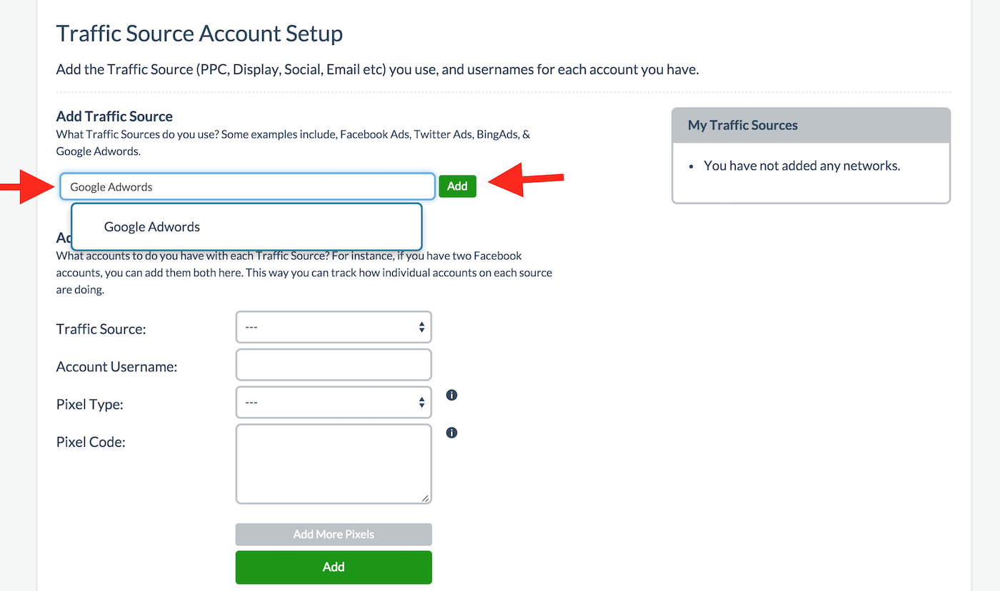
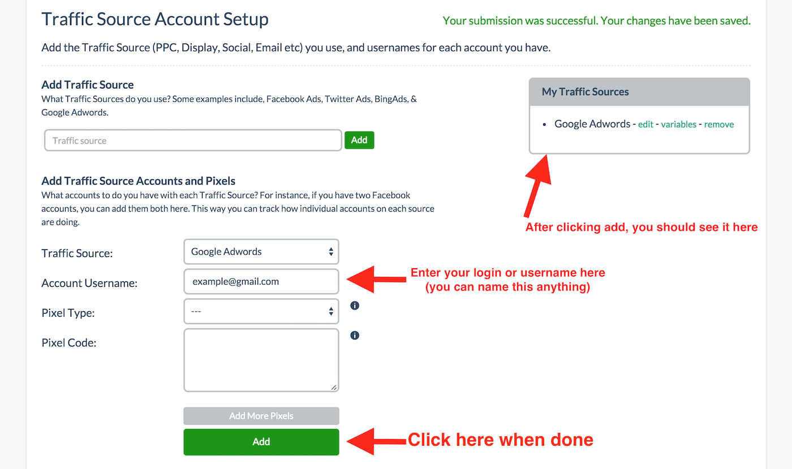
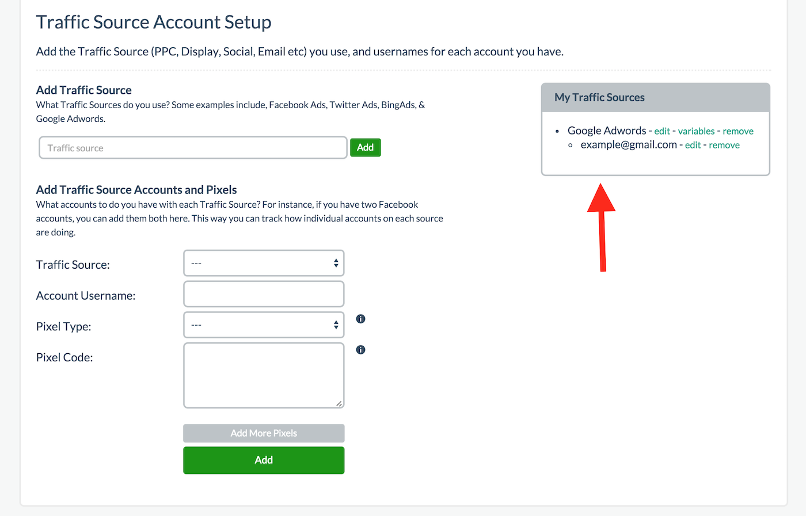

# Step 1 - Traffic Sources

This is the step where you enter your traffic source. Basically where you intend to drive traffic from. 

In the example below, I am using Google Adwords as an example. Simply type in Google Adwords (you can name this whatever you want as this is for your reference) and click Add. There may be an autocomplete option that pop ups.

Once you click add, you will see it get added to the box on the right hand side. Proceed to select the Traffic Source you just added and add your username or login in the second box. Please note you can name these whatever you want as well as they are also for your own reference so you know which account it came from.

**It is important to note that if you skip this step, you will get an error. An example of an account is something like example@gmail.com**

This step is required. While Google Adwords is a traffic source, people can have more than one account and entering an account helps you track where traffic is actually from even if you only have one account. Please see the screenshot below.

Pixel Type and Pixel Code are both OPTIONAL. They are for traffic sources that offer a tracking pixel and if you want to include it for tracking purposes so that when the Prosper Universal Tracking Pixel fires, it can fire off these additional tracking pixels as well but they are not necessary.

If you decide to use this option, please refer to the traffic source as to what kind of pixel type you need. **If you require assistance at any point, please subscribe to a support plan.**

If you completed the steps above, you should see a final screen like the one below showing that your traffic source and account has been added. You can add multiple accounts to any traffic source. Simply select the same traffic source and add a new account. You can add additional traffic sources by repeating this step and they should all show up in the right hand side box. Please note for each traffic source, you must also include an account.

If you look at the screenshots above, you may also notice that there is a variable option next to your traffic source. You can technically add variables you want to track here but for the most part, we recommend you use C1-C4 options in Step 8 (which we will get to later) unless you specifically have tracking parameters you must use besides the available C1-C4 options such as any utm parameters. If you are unsure what I mean by all this, it probably means this does not apply to you and you can safely ignore this paragraph.

When you're done adding all your traffic sources and their respective accounts for each traffic source, **[please click here to proceed to step 2](03-step-2.md)**.