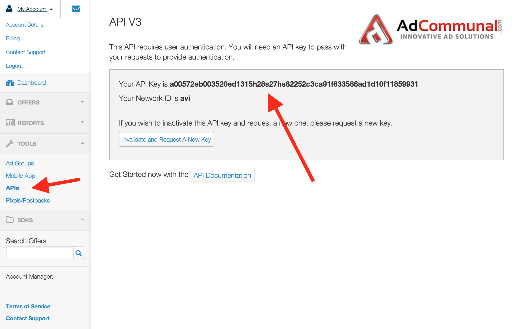
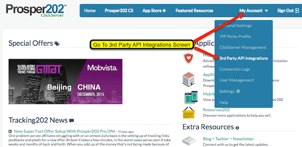
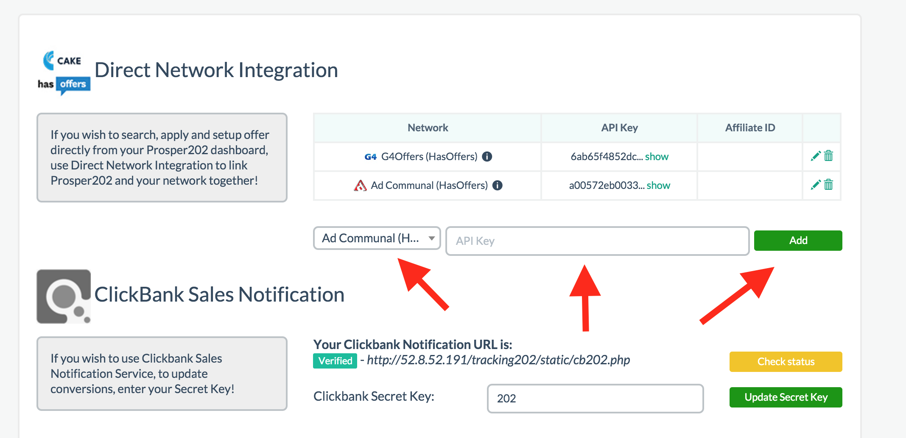
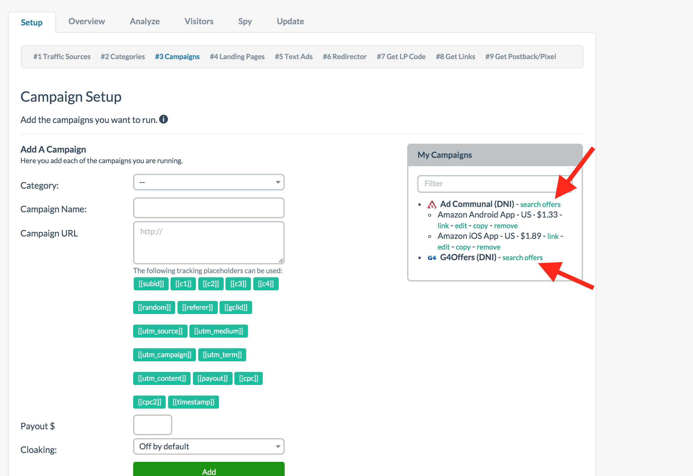
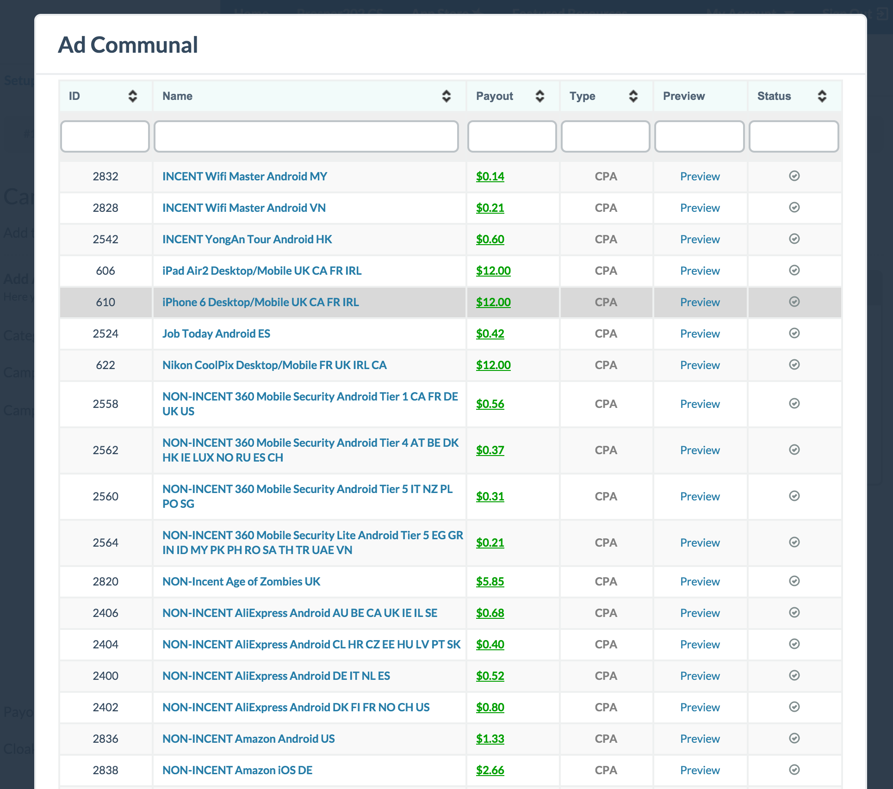
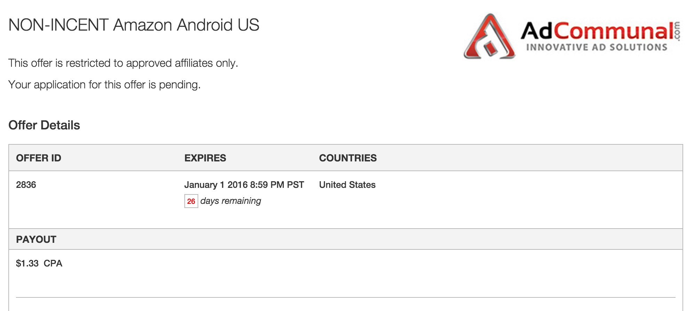
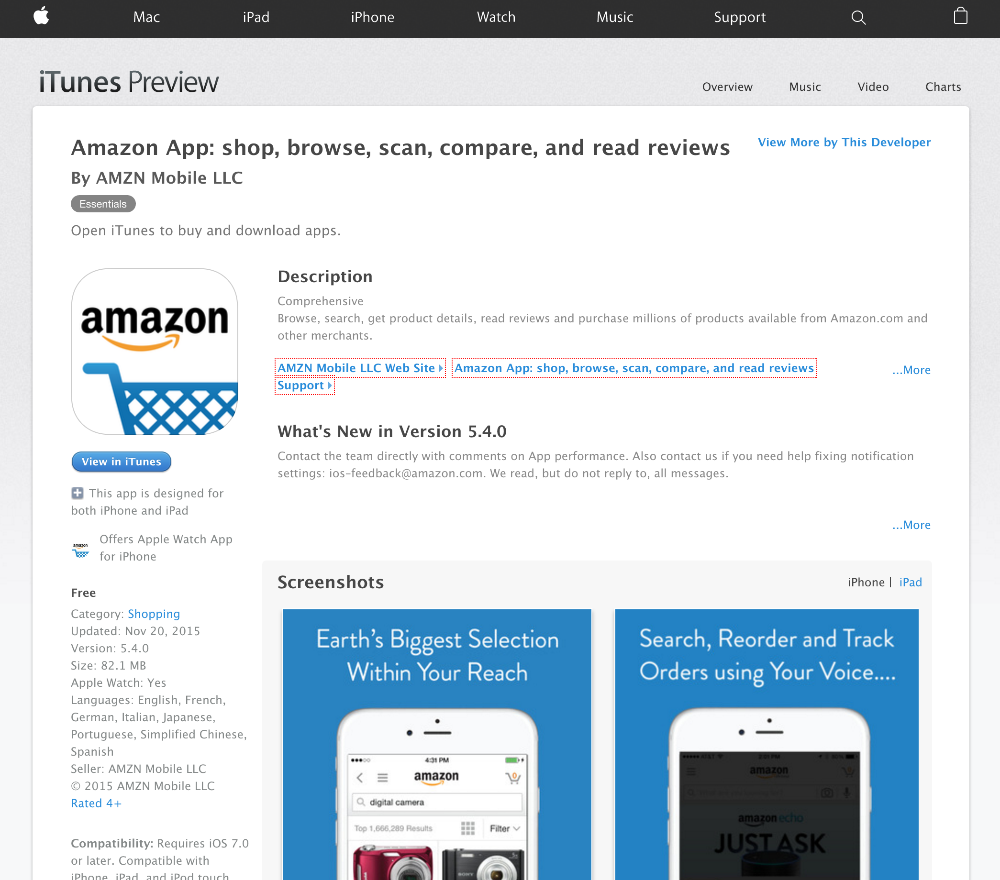
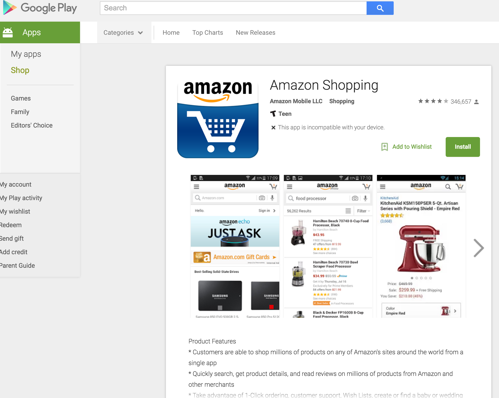
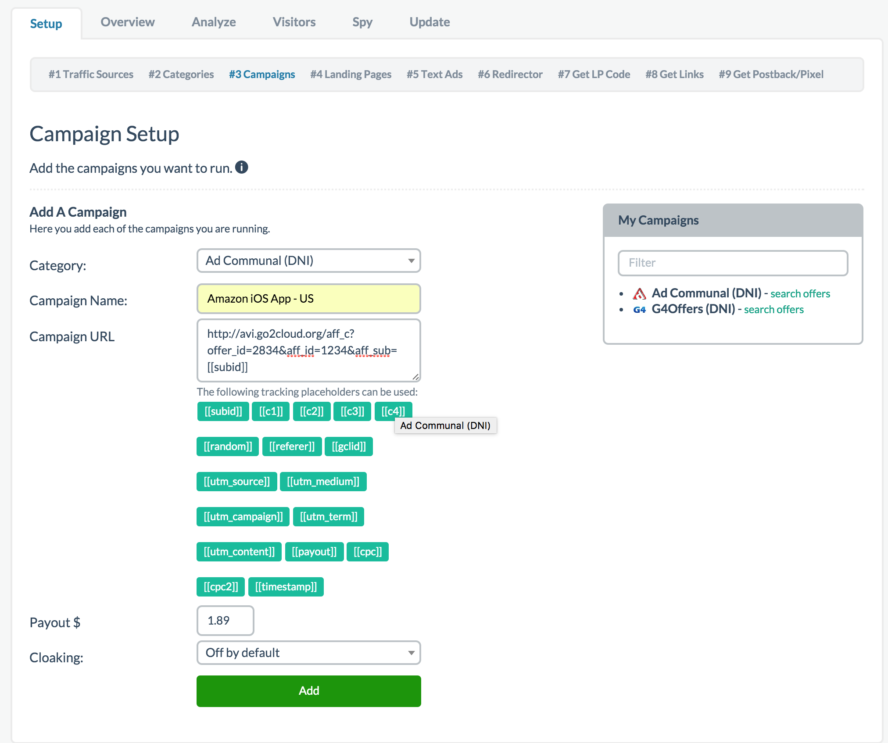
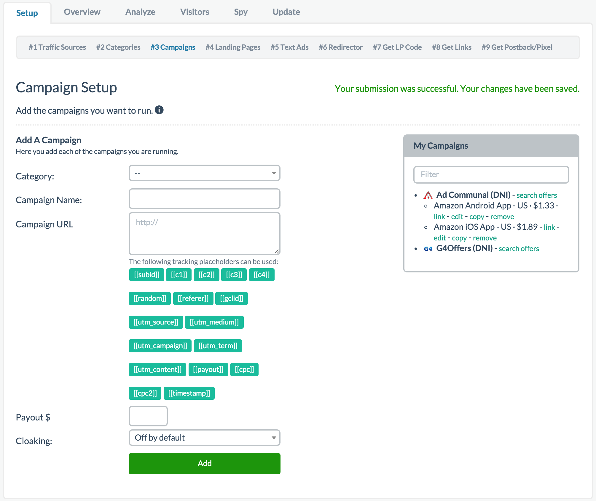

# Step 3 - Campaigns

This is one of the steps most users often struggle with, **please pay attention and read carefully**. If you still require assistance after following the steps below, please feel free to sign up and subscribe to one of our **[support plans](http://join.tracking202.com)** for further assistance.
 
Here we will cover two methods of completing this step. You can choose from Direct Network Integration method if you're on one of our DNI partner networks or the manual setup method. You can choose which method you prefer below:

QUICK LINKS: **[Direct Network Integration](04-step-3.md#section-direct-network-integration-method)** OR **[Manual Campaign Setup](04-step-3.md#section-manual-campaign-setup)**

PLEASE NOTE: There is also a new transaction ID system that allows users to track sales through funnels or upsells that tie to the same transaction. **[You can read about this here separately](999-transactions-id.md)**.

---------------------------------------------------------------------------------------------------------------------------

## Direct Network Integration Method

The first is through our DNI partner network setup. Currently, at the time of writing this document, we support two different Direct Network Integration partners: G4Offers and AdCommunal. **[Click here a current list of DNI support networks](../partnering-with-us/02-dni-networks.md)**. Below is an example of how to setup this campaign through DNI with AdCommunal but G4Offers should be similar.

Please note you should apply and already be an approved affiliate for these networks before you can do the following.

**Step 1: Get Your Network API Key**

Log into AdCommunal and grab your API key by selecting APIs under Tools in the navigation bar as shown below:

**Step 2: Click Over To The 3rd Party Integrations Page in Prosper202 Pro**

Click on My Account and select 3rd Party API Integrations as shown:

**Step 3: Select Your Network And Paste In Your API Key**

Select your DNI Partner Network from the drop down, paste in the API key you got in Step 1, then click add.

**Step 4: Search Offers Within Step 3**

Now navigate back to Step 3 in your Setup and you'll see a search offer integration available next to your network name:

**Step 5: Select Your Offer and Do 1-Click Setup**

Clicking on the search offers link will bring up a screen with all the offers the network has available that you can choose from. If you're approved for the offer, you can simply do a one click to set it up:

If you're not already approved and the offer requires approval, it should automatically alert the network for the approval. Once approved, you simply just have to do the one click setup.

That's it, you're done. All the setup links and conversion tracking should be set up for you already. You just need to set up all the other steps you might be using and you're good to go.

**[Click here to proceed to step 4](05-step-4.md)**

---------------------------------------------------------------------------------------------------------------------------

## Manual Campaign Setup

The second method is the manual campaign setup and how Prosper202 historically works. If you are running campaigns on any other network that isn't a DNI partner, this is the method you would use to set up your campaigns.

**Category and Campaign Name**

In this step, you want to enter all the campaigns you plan to promote. Begin by selecting a category from the dropdown (these are from the list of categories you added in the previous step, Step 2). Assuming you do what we normally do, it'd be a list of networks you're working with. Enter what kind of offer you are promoting in the second box. Again, you can name this whatever you want as it is for your reference. 

In the example below, I chose AdCommunal (the network I added in the last step) for the Category. For Campaign Name, I will enter a name for the affiliate offer I intend to promote from AdCommunal. As an example, I can see AdCommunal offer Amazon App downloads available for promotion in the US. I actually see one for the iOS App Store (iPhones, iPads, and iPod Touches) and one for Android through the Google Play Store. 

**Amazon iOS US Offer**

**Amazon Android US Offer**

Checking out their respective offer pages also looks good as they are the official app stores:

**Amazon iOS US Offer Page**

**Amazon Android US Offer Page**

For this example, I'll go ahead and set up the iOS offer first.

As shown in the screenshot above, I selected AdCommunal as my network from the list of available networks that I set up from Step 2 and gave my campaign an easy to memorize name such as "Amazon iOS App - US" without the quotes. Again, you can name this whatever you want as it is for your own reference (Please see screenshot above).

**Rotate URLs**

If you just downloaded the latest version of Prosper202, this step no longer exists. However if you upgraded from an older version and you previously had this step setup, it still here mostly for legacy reasons. Because we can rotate URLs or do split testing on a separate step later in our setup (Step 6), this step is no longer necessary and outdated. The new version is much more robust and has advance features so we highly recommend you upgrade if you haven't already. Regardless, if you are on an older version (keep in mind we don't support older versions), I generally would keep this option as No if you still have it and if you don't, don't worry about it. Its irrelevant to new Prosper202 installs.

**Campaign URL**

This is the step that has most people making mistakes or confused. This is where you grab your affiliate URL from your network and enter it here. However, there is at least one required step. You must also enter the *SubID parameter* and *SubID token* along with your affiliate URL. 

**[Click here to review our section on SubIDs](../tutorials-and-guides/13-subids.md)**.

Every network has a unique SubID parameter. You can't just enter any SubID parameter you want. If you're unsure what the SubID parameter your network requires, please ask your affiliate manager for clarification. There are simply too many networks for us to list them all. 

*Affiliate URL*

For this step, my affiliate URL for the offer above is as shown:
**http://avi.go2cloud.org/aff_c?offer_id=2834&aff_id=1234** 

*SubID Parameter*

Because AdCommunal runs on the HasOffers affiliate network platform, like all other HasOffers SubID parameters, theirs is **aff_sub=**

To append the required SubID parameter, I simply just have to add an "&" and the SubID parameter itself to the end of my affiliate URL as follows:

**http://avi.go2cloud.org/aff_c?offer_id=2834&aff_id=1234&aff_sub=** 

*SubID Token*

The last required step is to enter the SubID token available among the list of shown tokens on the screen, in this case: [[subid]]

This subid token, unlike the SubID parameter above, is the same for everyone.

My final link that goes into Step 3 should look like this:
**http://avi.go2cloud.org/aff_c?offer_id=2834&aff_id=1234&aff_sub=[[subid]]**

In other words, the formula is something like:

affiliate URL + & (ampersand symbol) + SubID parameter (unique to each network) + [[subid]]

*Other Optional Tokens*

The other optional token parameters and placeholders are available for use if you wish to track other parameters. They are not required. In general we recommend using c1-c4 for tracking any additional parameters. 
[**Click here to read more about all the optional tokens**](../tutorials-and-guides/999-prosper202-tokens.md).

Now included in Step 8 are input boxes for these tracking variables so you don't have to enter them here. In fact, we recommend inputting the extra variables in Step 8.

Again, if you need assistance with this step, please subscribe to our paid support plan for further assistance.

**Payout**

Next, you simply just enter how much the offer pays. In my case, $1.89. You can enter the amount without the "$" symbol.

**Cloaking**

At the time of this writing, this option is still available but in future versions (possibly by the time you read this), it will likely be altered or removed. If you want to understand why, **[please click here to refer to our FAQ](../tutorials-and-guides/11-frequently-asked-questions-faq.md#section-does-prosper202-offer-cloaking-)**.

If you'd like, you can turn on cloaking but in all honesty, its probably best if you don't as most of the time people don't generally care to steal your campaign and if you're successful enough, people will find out what you're promoting. If anything, the redirects can cause your link to slow and on traffic sources where this matter (such as Google), it's more of a negative than a positive. I would generally leave this option off but up to you.

**Add**

That's it. Simply click Add and it should show up on the right hand side. You can go back and edit it later once you've added it. Please refer to the screenshot above for reference on anything discussed on this page as an example.

Now I'll go back and repeat all these steps to add in my second offer, the Amazon Android App - US.

**Final Result**

## Support

If you require assistance or need help with any of the above, please subscribe to one of our support plans.

**[Click here to proceed to step 4](05-step-4.md)**