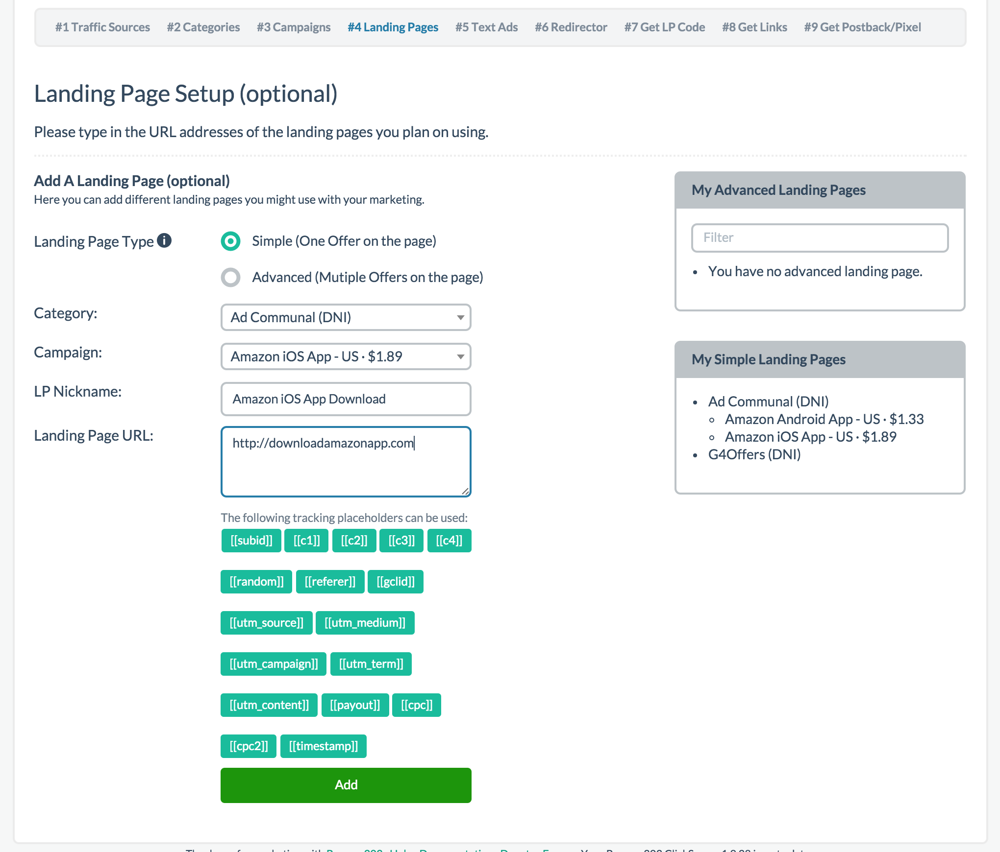
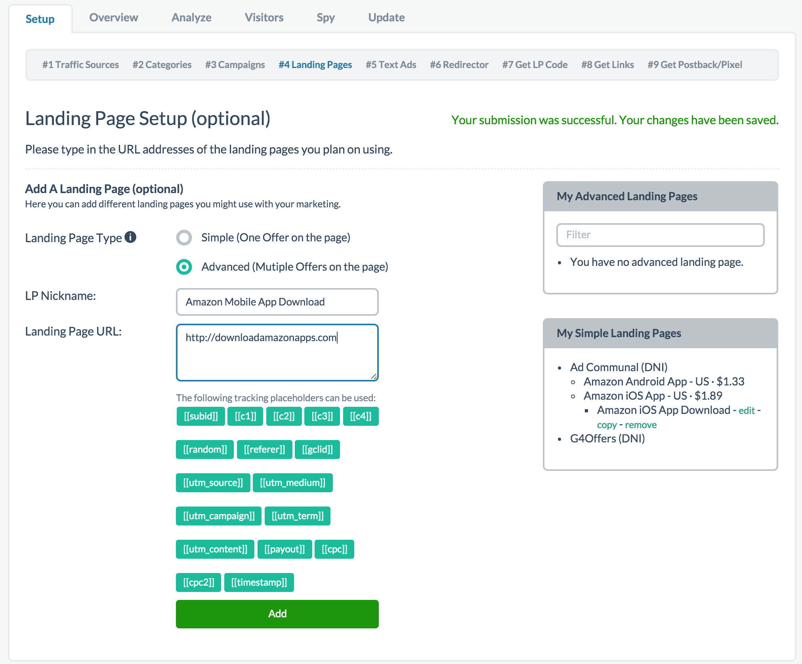

# Step 4 - Landing Pages

It is worth noting that this step is optional unlike the first three. If you wish to do direct linking to an affiliate offer, you skip this section. It is only necessary if you are, sending clicks to your own landing page (LP) first. For those unfamiliar with direct linking, what we mean is sending traffic straight from your traffic source directly to the affiliate offer through your affiliate URL.

If you are using a landing page, In this step you are given two options to choose from, Simple LP vs Advanced LP.

## Simple VS Advanced

Simple LP is designed for a single page, single offer landing page. In most instances, this likely applies to you. If this is the case, please select Simple LP. 

Advanced LP on the other hand was designed for multiple offers and/or multiple pages. For example, if you promote a product and wanted to upsell a second offer on your landing page and/or your landing page have multiple pages on the site, the Advanced LP would be the setup you select.

If you're in doubt about which one you need, Advanced LP is a safer bet.

If you have a different setup than what is described above, likely Prosper202 will still work but you'd have to pay for support for us to assist you in your unique setup.

## Simple LP

If you chose the Simple LP option, simple select your network/category from the dropdown (from Step 2), then select the offer on the second drop down (created in Step 3), and give your Simple LP a nickname (can be anything). In my case, I decided to name it Amazon iOS App Download in reference to what I'm promoting. Finally enter the full URL of your landing page including the http:// or https://. I chose to use a fake URL here. Then finally click add.

## Advanced LP

If you instead chose Advanced LP, the setup is still very similar except you don't need to specify your category (or affiliate network) or the campaign you are promoting. Simply give your LP a nickname and enter the URL and hit add.

That's it, you're all done with this optional step. 

**[Click here to proceed to Step 5](06-step-5.md)**