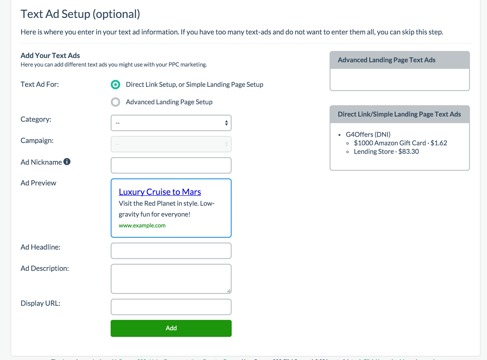

# Step 5 - Text Ads

Like the previous step, this step is entirely OPTIONAL and most users generally don't do this step. 

This step was intended for users to replicate their text ads inside of Prosper202 so they could track its performance. You can either make a duplicate copy inside Prosper202 for tracking purposes or as usual, name it whatever you want for reference purposes. As long as you know which ads mean what, you don't necessarily need to replicate the exact ad inside Prosper202 unless you want to.

I want to be very clear this is just a copy of the actual ad intended for tracking purposes. It doesn't actually replicate or link to the actual ad in any way.

## Selecting The Type Of Setup

First, you have two options. If you're Direct Linking without a landing page or using a Simple LP, choose the first option. If you're using an Advanced LP, choose the second option.

## Category and Campaign Name

If you chose Direct Link or Simple LP (the first option), like before, choose the category or network you are promoting, then select the campaign you are promoting.

If you chose Advanced LP, you only have to select the LP you are promoting.

## Ad Details

Next, give your ad a nickname that is easy for you to identify, fill in all the ad details the way you like it or the way your actual text ad is, then click add.

Repeat this as many times as needed to get all your ads in Prosper202.

Finally, when ready, **[click here to proceed to Step 6](07-step-6.md)**.