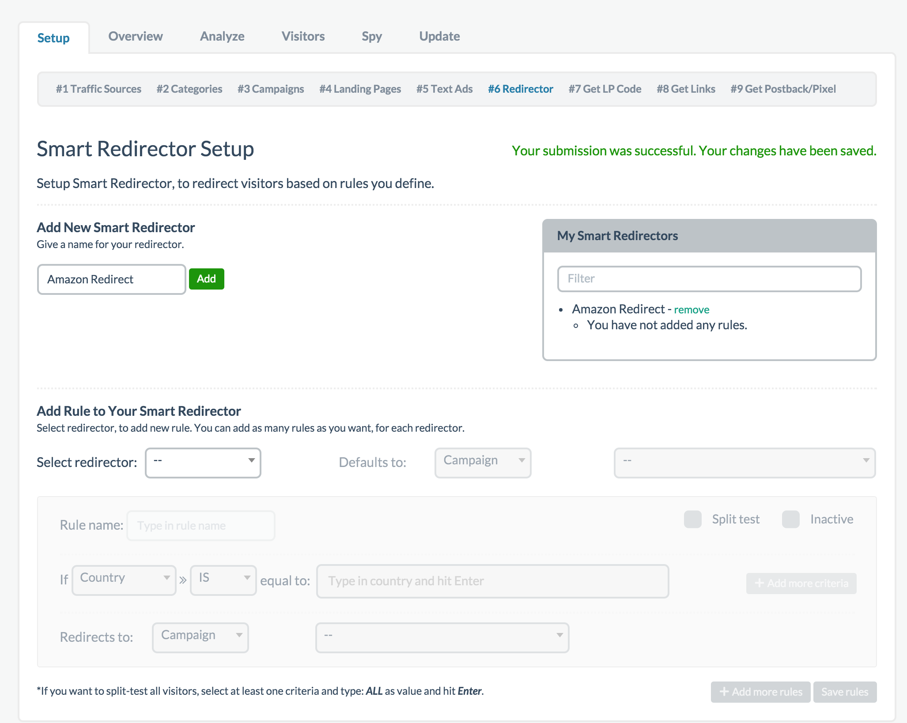
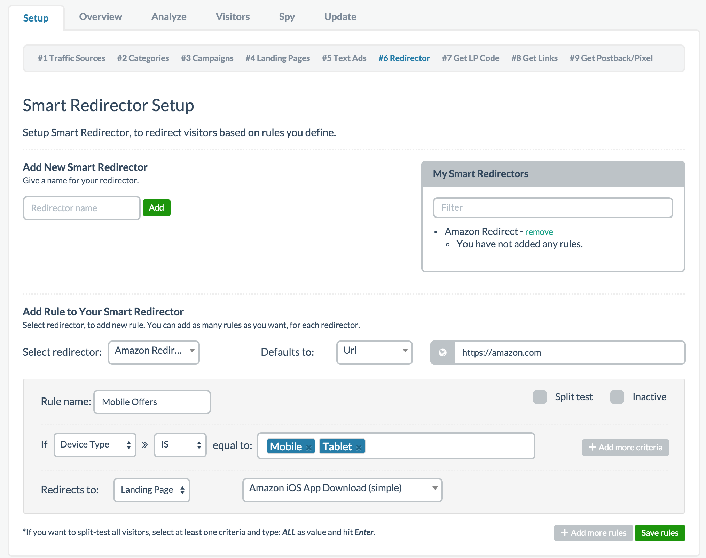
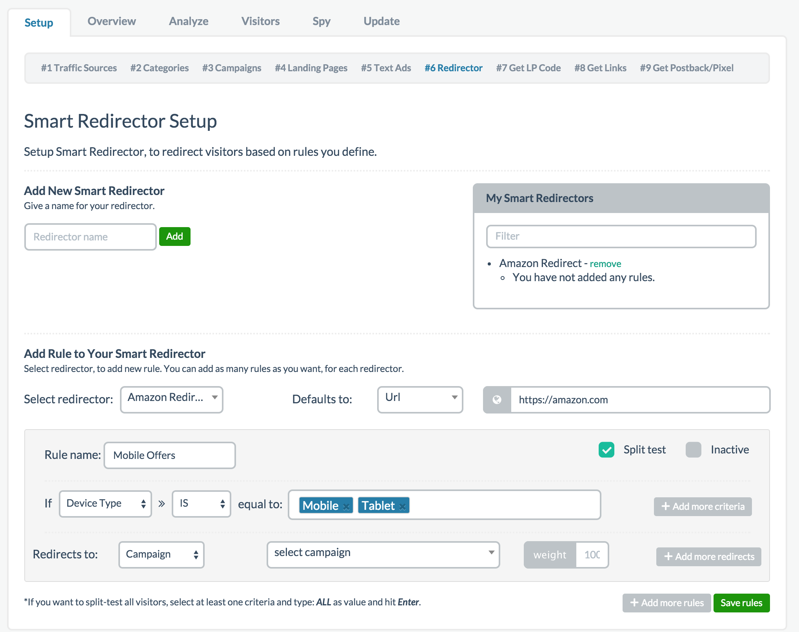
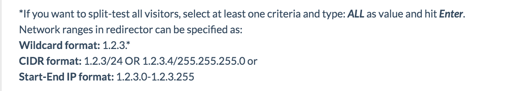

# Step 6 - Redirector / Split Test

This step is also OPTIONAL. If you like to redirect your URL or to do Split Testing, this is the step you would do it in.

The very first thing you should decide on is whether you want to **[redirect URLs](07-step-6.md#section-setting-up-rule-base-redirection)** or do **[split tests](07-step-6.md#section-setting-up-a-b-or-split-testing)**. We'll cover how to do both here but they serve very different purposes. Let's dive right in.

## Setting Up Rule Base Redirection

Redirecting URL is useful because generally speaking, whether you are an affiliate or promoting your own product, you likely have specific customers you want to target. For example, as an affiliate, you might be promoting an offer designed specifically for US traffic. In instances like this, you might want to redirect non-US traffic to other offers. Whatever the case may be or whatever the reason you might have for wanting to redirect traffic, here is how you do it.

First, you must give your Smart Redirector a name. You can name it anything you want. Then click add. It will get added to the list on the right. Once you've added a Smart Redirector name, it should be available in the dropdown below where it says Select Redirector. Selecting the name you just created activates the grayed out area.

The first thing you want to do is set a default URL where the traffic goes to if no rules are matched. This could be a campaign you've set up, a landing page, or a generic URL to any website. For the sake of this example I just put amazon.com as my default URL but you should set a default URL that matters.

Once you've done this, you must give your rule a name. Again, this can be anything you want.

As you can see above I gave the Smart Redirector the random name Amazon Redirect. Then I chose amazon.com as the default URL. Finally I gave my rule name a name of Mobile Offers. Now, I want to select the target parameters. You can select the dropdown and choose from a list of different types. If you want to target mobile users to go to a mobile offer, you would select the mobile option. Next you can set the parameter to equal to IS or IS NOT. Finally, you can choose which parameters to target. Select certain types to target can pre-fill the parameters for you. In the example above, it gave me a few pre-fill options and I kept mobile and tablet since I want to target mobile traffic. 

My example above states that if any device type is mobile or tablet redirect them to where I specify. I chose to redirect to my landing page and selected one of my landing pages. Now all I have to do is save the rule.

If I was targeting countries, I can type in the specific countries or I can also type in ALL which will target all countries. That's it.

Below is a video tutorial of what was just covered:

**Video:** [Prosper202 Pro Tutorial: Setting Rules Based Redirection](https://www.youtube.com/watch?v=f_lSpq_Sme0&feature=youtu.be)

## Setting Up A/B or Split Testing

Lets say you're not looking to redirect traffic but instead you want to split test your campaign. The setup is very similar. The only difference is you must check the box that says Split Test.
By selecting this option, you'll notice the options changed a bit. You can select any number of URLs you want to split test and add more as needed and any you want to make go inactive at any time, check the inactive box.

Once you've set up all the different URLs you want to split test, you can give them a weight. This determines how often each link gets rotated. For example, if you have four links you want to split test and you want the traffic distributed evenly, you can enter a value of 25 for each of the weight. There are many ways to do weight calculation but in my experience its probably easiest to divide by 100 (as if it were percentages) and enter that into the weight box). So in this example, a weight of 25 per link out of 4 links is like saying 25% each or rotate them evenly. This is not entirely accurate but it works well for weight distribution.

Below is a video tutorial of what was just covered:

**Video:** [Prosper202 Pro Tutorial: Setting Up A Split-Test (A/B Testing)](https://www.youtube.com/watch?v=QTc0wvDEfeE&feature=youtu.be)

In the latest update for Prosper, we now support more rules for targeting as well as targeting IP ranges. Please see below:

When you're ready, **[click here to proceed to Step 7](08-step-7.md)**.