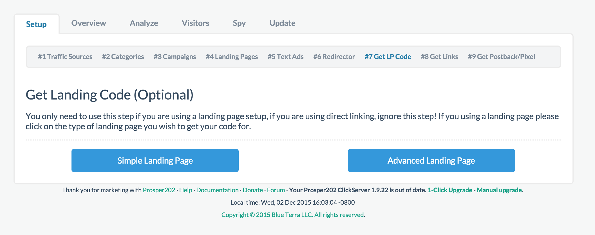
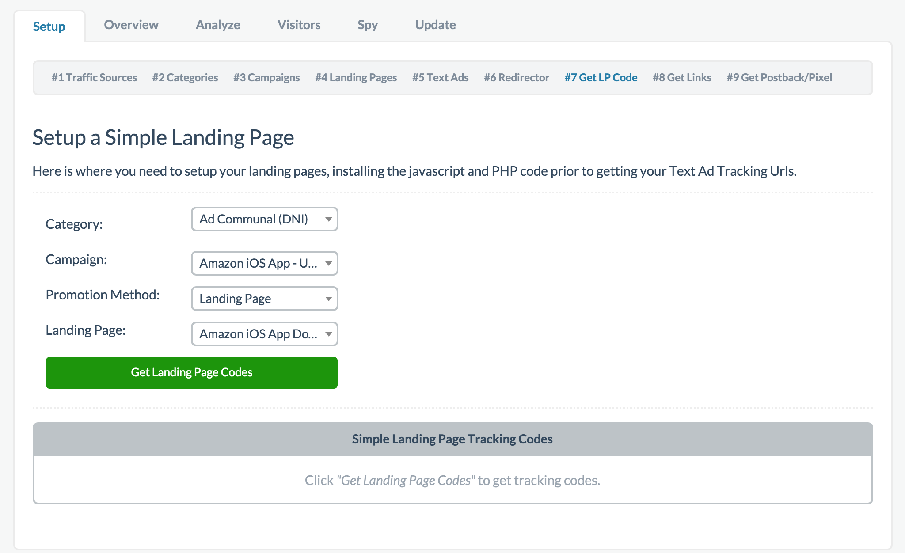
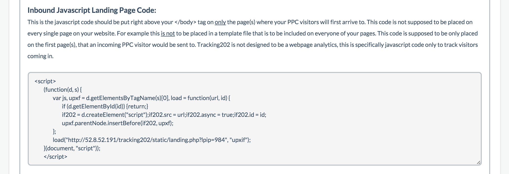
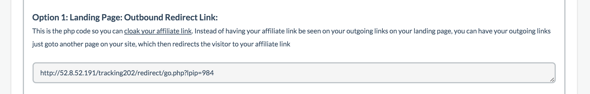
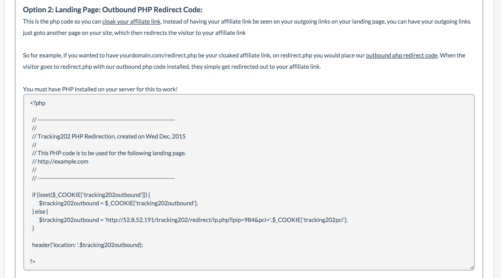
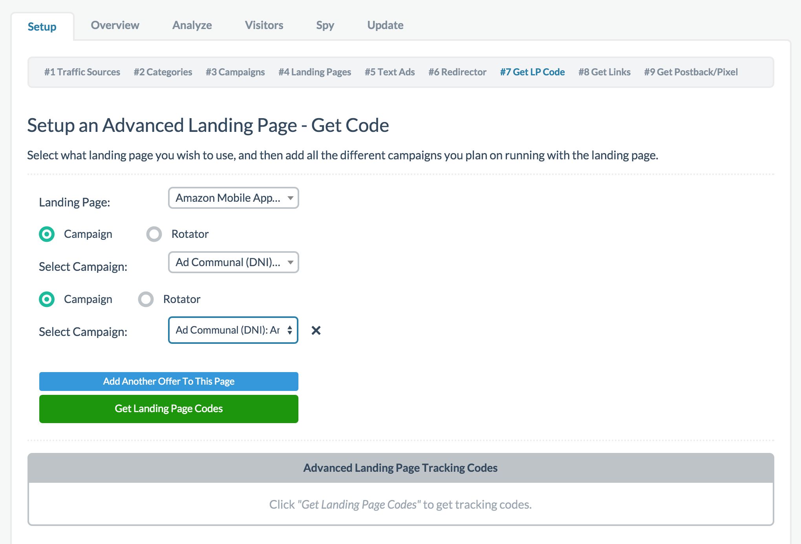
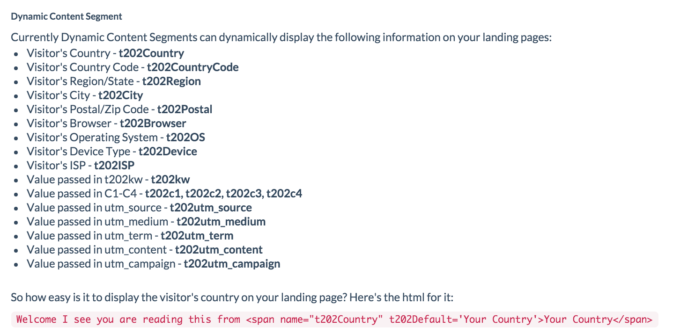

# Step 7 - Landing Page Codes

This step is OPTIONAL if you are not promoting through a landing page but instead are direct linking. Otherwise if you are promoting through a landing page and have completed Step 4, you will need to complete this step.

## Simple VS Advanced

First, select whether you're promoting a **[Simple LP](08-step-7.md#section-simple-lp)** or an **[Advanced LP](08-step-7.md#section-advanced-lp) ** 

## Simple LP

If you chose the Simple LP option, you'll see a screenshot similar to the one below. Enter all your information in the dropdowns and click Get Landing Page Codes.

**Simple LP Codes**

After you click Get Landing Page Codes, some code should have been generated. The first shown directly below is your inbound landing page javascript code. This Javascript code must be placed inside the head tag of your single landing page so that when the visitor lands on the site, the javascript code will load. Copy the code exactly and paste it inside your <head> and </head> tags. If you're using something like Wordpress, please refer to our Wordpress section instead.

Next, you're given a few options for outbound code. These are code you must use to redirect the visitor from your landing page to the offer. You must use one of the provided methods. The easiest is usually option one where you can replace the outgoing URL with the specific PHP link provided as shown below. You can copy the code and replace your link URL with it.

The alternative solution if you don't want such an ugly URL as an outbound link to the offer, you can copy the next section of code, save it in a .php file such as offer.php, and use that as the outbound link. Copy and paste the code exactly into a new .php file. Upload the file to your website and use it as the outbound link. This option is likely the more popular option.

Finally if you need it to redirect out because you need to load other scripts such as retargeting or conversion pixels first, you can use the last option but in most instances, you won't likely need to use this last option.

## Advanced LP

If you selected the Advanced LP because you have multiple pages and/or multiple offers, simply select your options. In general you'll be using the campaign option select to add multiple offers if you have them when setting up your advanced LP as shown below:

You can choose rotator option if you setup a specific rotator rule in Step 6 previously and wish to use it here.

The inbound and outbound code usage are exactly the same as the one for Simple LP. The only difference is you have more outbound codes for each offer you are promoting on your Advanced LP. Please see above section on how to implement inbound and outbound code.

## Dynamic Content Segment

We have available dynamic content you can integrate into your LP to make it more targeted. Please see the list below and in your setup Step 7:

**[Click here to proceed to Step 8](09-step-8.md)**