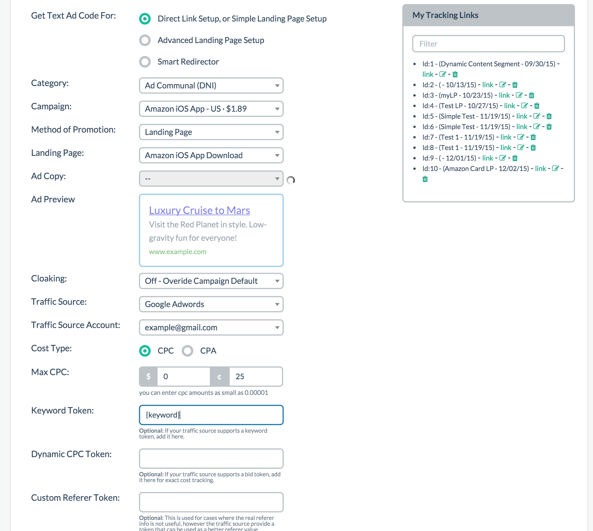
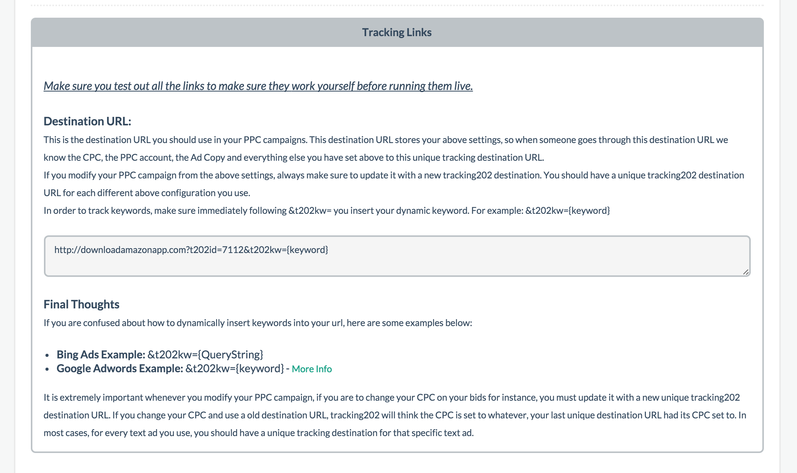

# Step 8 - Tracking Link

This step is required. You must generate a tracking link. This tracking link is the link you'll use to place as your destination URL in your traffic sources.

## Setup

By now you're a pro at this! Simply select the option you're promoting whether that's direct linking or simple LP, advanced LP, or smart redirector (from Step 6). Then proceed to select all the appropriate options. Paste the final generated link into your traffic source. Please do not enter your direct landing page URL as this would cause issues.

## Options

For any optional step you skipped, you don't have to select an option for those. For example if you skipped step 5, there would be nothing to select under Text Ads.

## Cloaking

As mentioned before we are looking to phase out this option but it shows up here again as a way to override the previous setting in case you chose yes and wanted cloaking on during the setup. This would effectively override the default setting you set up earlier. As usual, it is probably best to keep it off.

## CPC vs CPA

You can choose which type of traffic you are paying for. It will calculate an average estimate based on what you type here. We don't have 100% accurate tracking so this is based on an estimated average if you're going with CPC. Finally, enter the dollar and cents amount.

## Custom Token and Variable Tracking

If you know some of these tokens here, Prosper will automatically inject them into the proper place when you generate the link. In the example provided in the screenshot above, I know that Google requires the {keyword} token to track keywords so I typed it in here. The others are optional tokens you can enter.

There are also optional tracking variables C1-C4 you can add unique tracking to, but otherwise they are unnecessary and not required.

Please note tokens are based on what is available by your traffic source or network and there are simply too many for us to keep track of so we recommend you look up this info yourself.

## Generate Tracking Link

Once you've generated your tracking link, simply paste it into your traffic source as the destination URL and you're good to go.

**[Click here to proceed to Step 9](10-step-9.md)**
