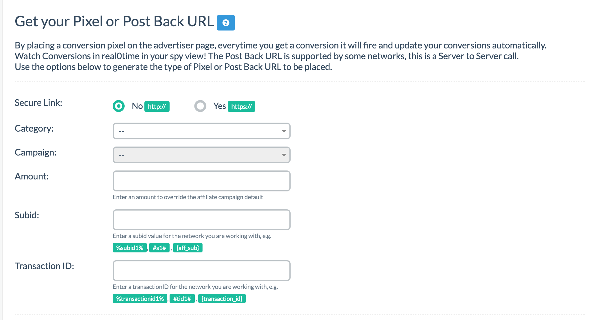
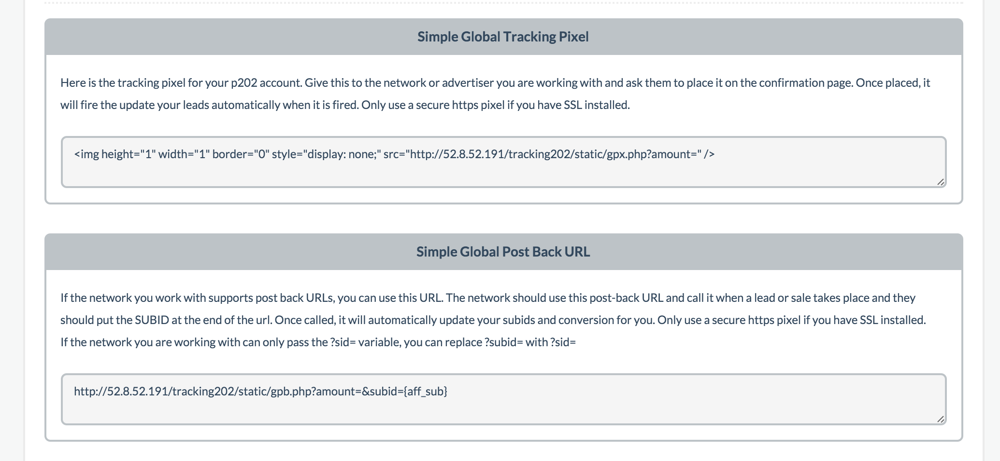

# Step 9 - Conversion Tracking

If you've been using Prosper, this step may look slightly different. This is the step necessary for you to set up to be able to track conversions inside of Prosper202. Different networks offer different conversion tracking options and we offer a variety of options to suit each different network needs. If you're promoting your own offer, unless your site or system supports all these various tracking methods, likely pixel is your best option. Otherwise, some networks prefer pixel tracking while others prefer postback URL. Check which method works best with your network.

## Selecting An Option

Select secure link for whether you're running http or https. Please note that if you are on https, your entire setup should be on https such as your Prosper install, your LPs, and the offer itself if you're running your own offer. Otherwise this may cause issues with tracking.

Select the appropriate options for Category and Campaign.

## Amount

This is OPTIONAL and overwrites the payout amount previously set in Step 3. If you do not wish to overwrite it, leave it blank.

## SubID

Finally enter the SubID parameter **type** as shown in the example. For our example, we would use {aff_sub} since HasOffers uses aff_sub as their parameter (as shown in Step 3). This is unique for each network and must match the one you used in Step 3 earlier. The setup may be slightly different but it should be the same parameter type.

**PLEASE NOTE: **If your network commonly uses s1 as its SubID token parameter, please switch to using s2. Do this also for Step 3.

## Pixel vs Postback

Once you have done that, you're given the option to choose tracking pixel or postback URL base on what your network supports. And that's it. You're done with this step.

Please note that if you need to, you can also download a subids report from your network to upload into Prosper for any missing leads via the Update tab.

**[Click here to proceed to the final step, Step 10](11-step-10.md)**