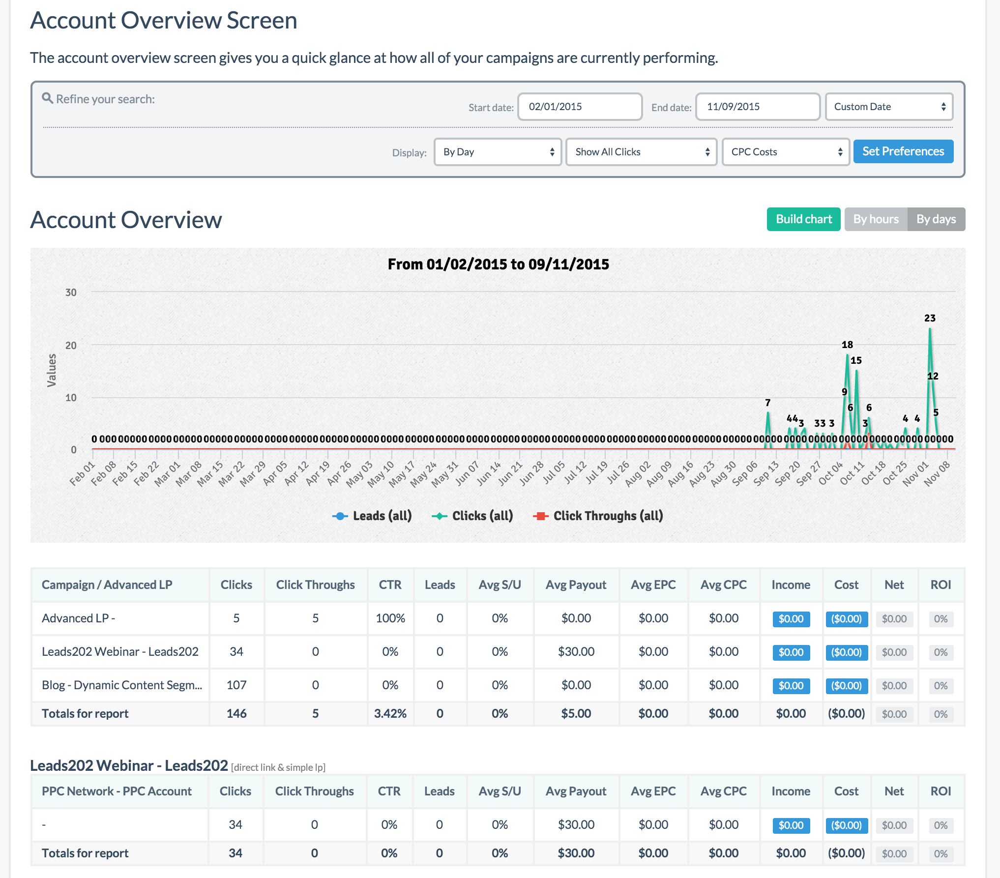
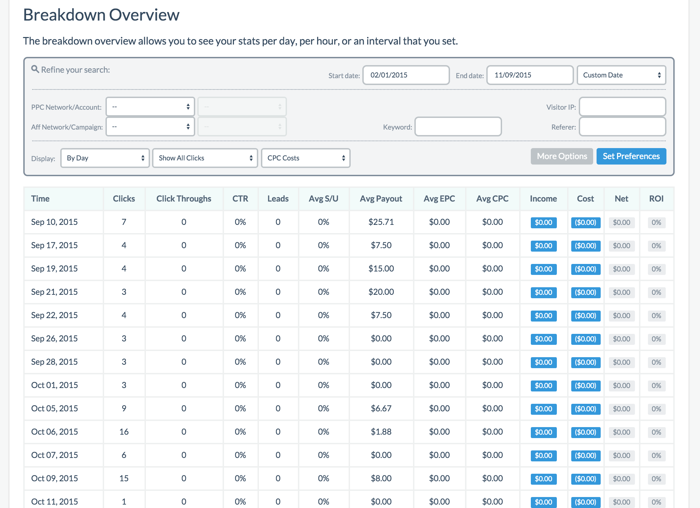
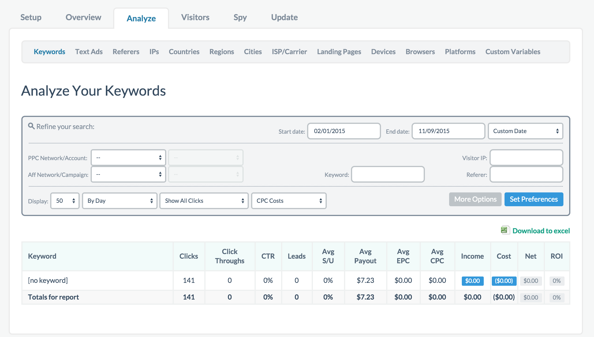
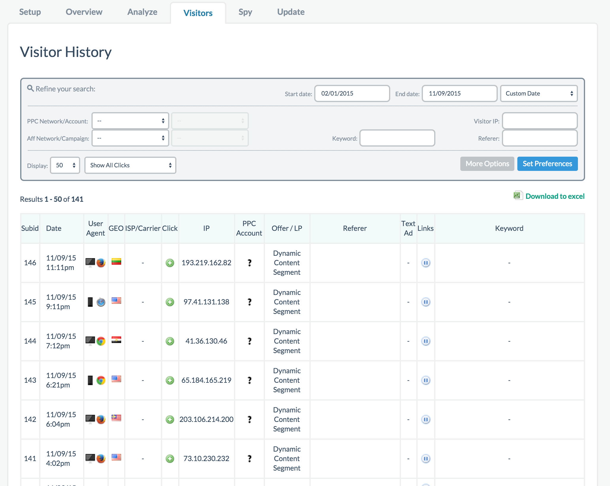
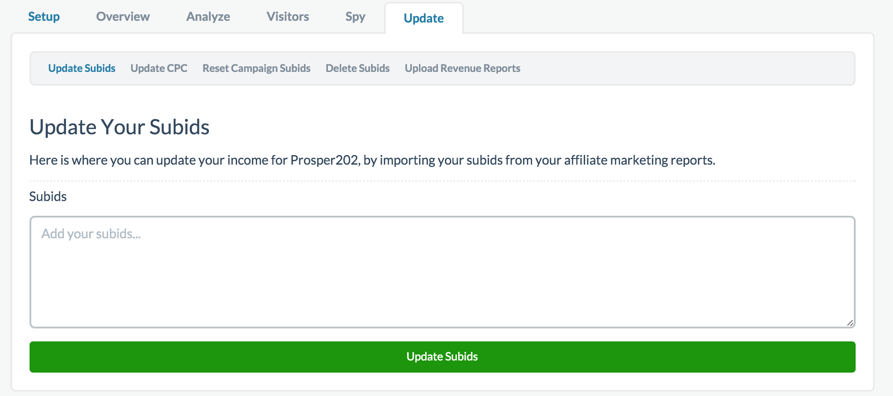

# Reporting

We're going to do a quick rundown of all the reporting available in this section. Please feel free to explore Prosper202 to get a better understanding of what you are looking at beyond what is written here.

## Overview

Overview in general gives you a bird’s-eye view of your overall campaign performance. Here we'll go over the various sub-sections under Overview.

**Campaign Overview**

By default, when you click on your Prosper202 CS link, the first screen you see is the general overview tab, specifically on Campaign Overview, with a general breakdown of your overall campaign performance. This screen gives you a general look over how all your campaigns are doing.

## Breakdown Overview

Next we have the breakdown overview section which gives you a overall daily breakdown of your campaigns' performance. You have some filtering capabilities here but this is a good way to see a quick day to day breakdown.

## Day Parting and Week Parting

The next two sections allow you to see hourly performance (day parting) or which day of the week your campaign is performing best (week parting). This is useful for a granular level look at how your campaign is performing and great if you want further control over time on the specifics of when you want your campaign to run efficiently.

**Group Overview**

The last section in Overview warrants its own section in this guide so please refer to the guide section on Group Overview.

## Analyze

The analyze tab and its numerous sub-navigation options gives you a quick glance at the various types of performance based on which option you are looking at. Users often confuse this with specific options they are looking for when they can't find specific stats they want. If you are in the Analyze area and are unable to find specific stats you want, try Group Overview.

## Visitor and Spy Views

The spy view is a live time feed of all your clicks coming in. It shows a limited number of feeds and refreshes constantly. If you want to go through your click history, thats what the visitor tab is for. They are essentially the same except visitor is your history log with no real time update and spy view is your real time feed of the past 24 hours worth of clicks without the history log.

## Update

Finally you have the update tab. Update allows you to update various specifics such as manual uploading of converted SubIDs, deleting SubIDs if you want to clear away specific ones or campaigns, updating CPC, and so on.

These various steps are fairly self-explanatory and allows you more finite control over your campaigns. 

If you require further assistance or are confused by anything listed here, please subscribe to one of our support plans for further help.