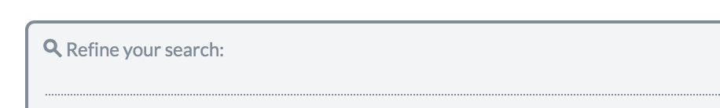

# Group Overview

## General Info

One of the most common confusions we often get that comes up in support is when users try to filter their campaign for data, in particular landing page performance but also specific filters they are looking to view, generally under the Analyze section, and could not find what they are looking for. They then think its a bug and try to report the issue or come to us for help on figuring out where the reporting is.

Group Overview can be found by clicking on the Overview tab and the Group Overview sub-navigation tab. Please refer to the screenshot below.

Group Overview is one of the major places were you can get stats on your campaigns including specific LP performance analysis. Let's dive right in.

## Group Overview Options

The first thing to note is you can expand the options available by click on "More Options" as shown in the above screenshot. Doing this will show you all the available options as shown below:

## Not A Search

One of the first things to note is there have been some confusion in the past where users thought they could type where it says "refine your search". Its worth noting this is not a search field and you can't actually try to type anything here. Instead your refinement options are what's available in the white boxes below.

## Date Range

Another key thing to pay attention to is selecting the proper date range to filter your results. We've seen a number of people not filter for the correct dates and wonder where there data is. So please be mindful of this.

## Initial Filters

Next, you can filter by specific PPC networks and even further with specific accounts or specific affiliate networks or categories and further with specific campaigns. Keep in mind these are all optional and the more specific you make it, the more targeted the results will be. You have the option of filtering for specific keywords, IPs, or referrer. If you don't have anything specific to filter for in this area or are unsure, leave it blank.

## More Options

This is the area that is likely what most people are looking for. If you run landing pages, do split testing, etc... You likely want specific LP performance. Once you've expanded the more options, you'll see a list of additional filters that allow you to filter by specific LPs, type of traffic such as mobile or country the visitor is from, and more.

Once you've set all your specific filters, click set preference and it should update with the correct states. Please note that sometimes its better to be less specific than to be exact when filtering for results you are looking for.

## Pagination

Prosper now supports pagination if your reporting is extensively long.