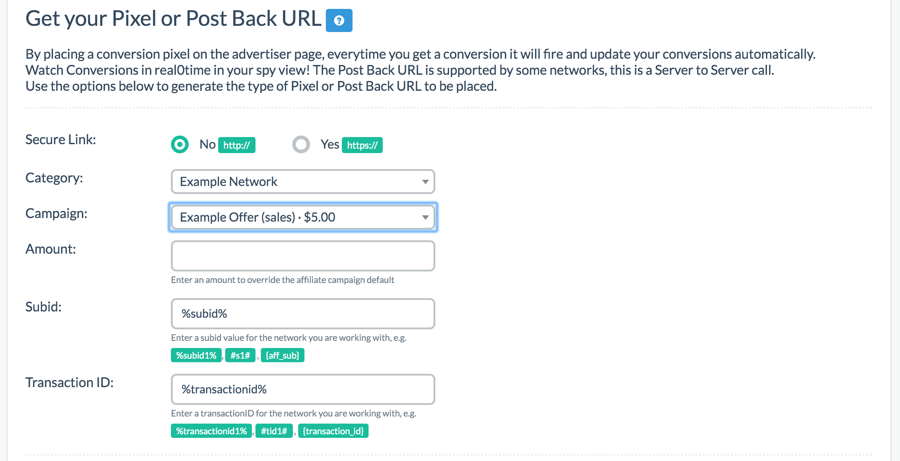

# Transactions ID

If you're interested in tracking more than one conversion where there are upsells through a funnel type setup, then this new feature applies to you.

## Funnel Tracking

It is important to note that Prosper does not track visitor footprint. What this means is we can't track if a user bounces from page to page to page on your LP if you have multiple pages nor do we keep track of each step of a funnel a user goes through. For that, you'll need another type of tracking software.

What we do regarding funnel tracking is we can track conversions with each step by utilizing something called a Transaction ID. If you're working with an affiliate network, they should be able to have a way to pass a Transaction ID with offers that fit this kind of setup. If you're doing it on your own offers, you'll need a way to pass along a transaction ID that can link all campaigns together.

## Setup

The setup to do this is similar to how you would [manually set up a campaign in Step 3](04-step-3.md). For example, if I have an offer that is an email opt-in first, I would set up my affiliate link as usual per Step 3 instructions and name it something like "Example Offer (lead)". Please reference Step 3 if you are unfamiliar with how to properly set up a link with the correct subid parameter and token as the parameter is unique to every network.

As you can see from the screenshot above, I've entered an example of what a leads offer in the funnel might look like for the campaign. After clicking on add, you should see it added to the right hand side along with the option to now copy that campaign as shown below:

Clicking on this will duplicate this campaign by making a copy via the option available. Once you have a copy, simply rename this copy to something else. In my example, I chose "Example Offer (sale)" assuming it was a sale. Doing this will essentially utilize the same affiliate URL but with two different names for two different steps in the process. Repeat this for each offer in the process. Adjust the price amount as needed for each appropriate step as well. You can see an example below:

You should now see everything added to the right hand side looking like this:

Once you finish this adding all the offers for each step, make sure you set up an Advanced LP in Step 4, place the appropriate links as you normally would in Step 7 along the funnel, and you're good to go.

## Final Step

Once you've done that and saved the offers, when you generate your conversion tracking in Step 9, be sure to have a way to pass a transaction ID over such as a transaction ID token that can be placed into the postback or pixel. If you're working with an affiliate network that has these kinds of offers, they should have an available transaction ID token. Make sure you also enter the correct subid parameter similar to the one used in Step 3 so they match. For each visitor that goes through the funnel, each of these campaigns in each step will now have that transaction ID linking them together. By placing your pixel or postback at the end of each step of the funnel, and now you have a way to link them together through the transaction ID allowing you to track all upsells.

In our examples above, I'd generate a pixel or postback for each offer and place them in the respective part of your funnel for tracking purposes. For the first one, we would generate something similar to the example below:

After placing that on along the funnel right after the first offer opt-in, I'd continue doing so for the rest of the offers. In my example here, we only have two offers, so I would make another pixel or postback for the last offer and place it on the final thank you page. Here is what the second one generated should be:

Once you're done with this, that's it, you're not finished. Please note that amount was kept empty because I didn't need to override any of the amounts but if you do, you could override the amount at the time of generating your pixel or postback.

This should ensure your now able to track conversions along a funnel setup.