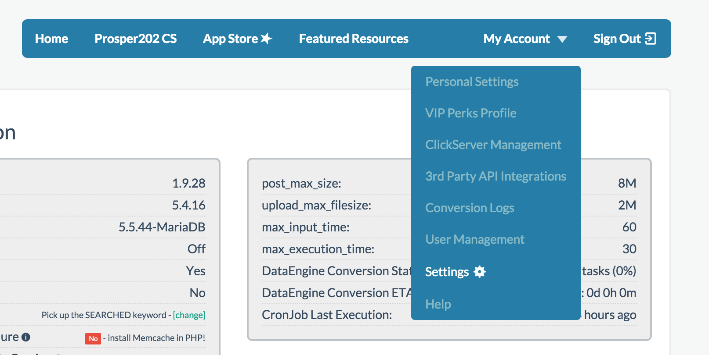
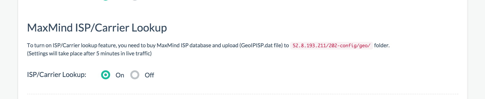

# IP and ISP DB Integration

## IP and ISP Database

Prosper202 requires the Maxmind IP and ISP Database in order to report the user's IP and ISP information, including the country maps you often see in sample screenshots. We do not include this in the free download since this is a paid database service provided by a third party company. Unfortunately we do not have this sort of data ourselves but we highly recommend Maxmind as we use their services ourselves.

To purchase the MaxMind IP and ISP Database, please go to: 
**[https://www.maxmind.com/en/geoip2-isp-database](https://www.maxmind.com/en/geoip2-isp-database?rId=tracking202)**

Once you have purchased this, you can follow the steps below to set it up.

## Setting Up ISP Database

Once you have purchased your MaxMind ISP Database, please upload the purchased file (**GeoIPISP.dat** file) to your **202-config/geo/** folder on your Prosper202 server. Once you've done that, go to your My Account > Settings inside of your Prosper202 install. 

Once there, scroll down to "MaxMind ISP/Carrier Lookup" and activate this feature by turning it on.

Once you've completed the steps above, please wait 5 to 10 minutes after live traffic has been going through the system for it to be implemented.