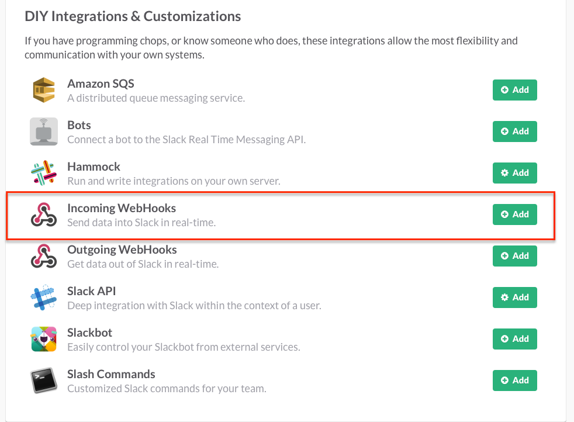
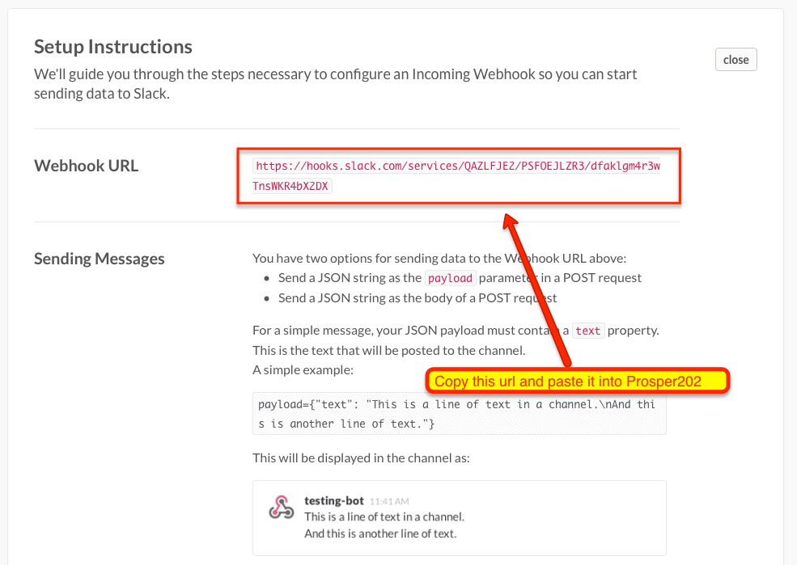
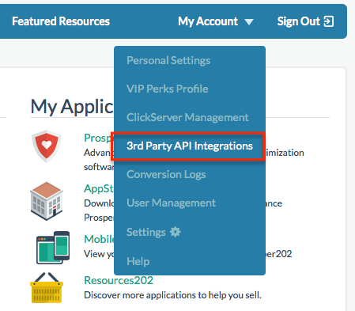
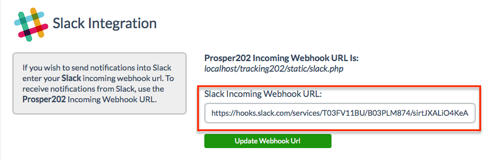
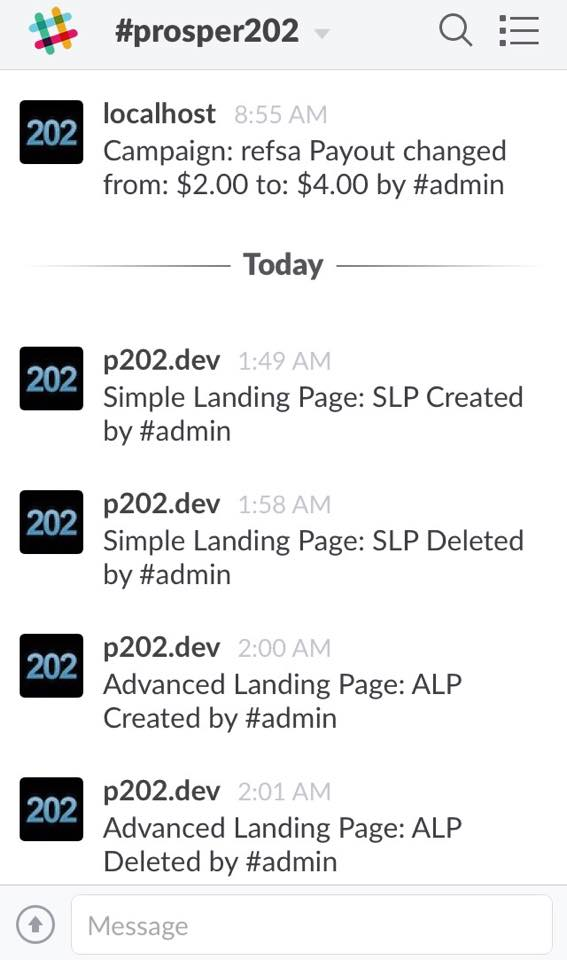

# 3rd Party Integrations

Currently inside your Prosper202 Install, we support a number of 3rd party integrations available to you. Below are the three integrations you will find:

## Direct Network Integration

Direct Network Integration allows you to quickly find and setup offers directly inside of Prosper202 without any manual work. You can review the section on Direct Network Integrations for more details about this. [Click here to go there now](10-direct-network-integrations-dni.md).

## Clickbank Sales Notification

Clickbank doesn't support Postback or custom conversion pixels, so to get real-time reporting of sales you can setup our Clickbank Sales Notification integration.

**Video:** [Setting Up Prosper202 and Clickbank Instant Notification](https://www.youtube.com/watch?v=M6zo3XuExL0&feature=youtu.be)

## Slack Integration

If you love using Slack and use it often as part of your workflow, then you might want to integrate Prosper into Slack. Our team uses Slack and we thought what could we do to help improve the process. By integrating Prosper202 into Slack, it will enable you to know exactly what every team member does in Prosper202 as soon as it happens? These notifications could then trigger a meaningful conversation.

Imagine this scenario, you get a notification on your phone alerting you that John just increased the payout settings on one of your top campaigns. This is going to affect your profitability and ability to scale in a good way. You ping John via Slack and find out the advertiser loves your traffic and can pay you more per lead. Jane, the campaign optimizer, immediately knows that she can start test bidding more aggressively to scale even faster. Before you even finish typing, you see a message from her stating that she's ramping up bids.

All this happens in a matter of minutes, and because everyone is on the same page, your team is in sync and working efficiently like a well tuned race car. This is just one example of what's possible once you setup your Slack integration in Prosper202. We've instrumented it to send meaningful notification for almost all actions that happen inside of Prosper202 Pro.

Another example is a feature that will help you to sleep soundly is the new intrusion detection alerts. We've always kept a log of the last 50 successful and non-successful login attempts into your Prosper202 account. But with our new integration with Slack, you also get real-time alerts when someone tries to login to your Prosper202 account unsuccessfully. You can then take immediate action to lock the user out. We are exploring providing a way to immediately block the user right from your Phone.

**Slack Integration Setup**

Step 1: At the bottom of the Slack integrations page, select the incoming webhooks option and click add

Step 2: Copy the generated Webhook URL

Step 3: Go to the My Account menu in Prosper202 Pro and select 3rd Party API Integrations

Step 4: Paste the webhook URL here and save

Step 5: There is no step 5. Start receiving real time Prosper202 Pro notifications sent to your Slack
